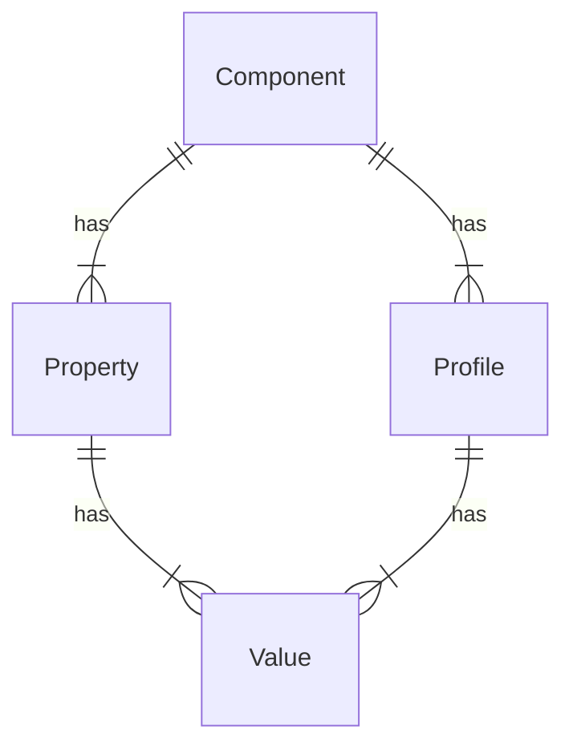

# Data model specification

This section describes the data model that is used for Device Detection
meta data. It can also be applied to other data domains.

This model has four main entities:

## Component

A **Component** defines a group of Properties that are related.

In a 51Degrees data set, each Property can only be related to one Component.
For example, the `Browser Name` Property is part of the `Software` Component,
whereas the `Model Name` Property is part of the `Hardware` Component.

The metadata associated with a Component is:

| **Name**        | **Type**                  | **Description**                                                                                                                                             |
|-----------------|---------------------------|-------------------------------------------------------------------------------------------------------------------------------------------------------------|
| Id              | int                       | The unique id of the Component. This is a number and will remain the same when a data file is updated.                                                      |
| Name            | string                    | The name of the Component that gives a more 'human' identifier than id. By convention, this is unique within the data file.                                 |
| Default profile | `Profile`                 | The default Profile for the Component. This is used to provide Values for the Component's Properties when a Profile matching the @Evidence cannot be found. |
| Properties      | `IReadOnlyList<Property>` | The Properties associated with this Component.                                                                                                              |

## Property

A **Property** is a named field associated with a specific Component. Each Property
can be assigned one or more potential Values.
Profiles will generally have a single Value for each Property, though some Properties
allow multiple Values to be assigned.

See below for the full set of meta-data for each property.

| **Name**          | **Type**                  | **Description**                                                                                                                                                                                                                          |
|---------------|------------------------|--------------------------------------------------------------------------------------------------------------------------------------------------------------------------------------------------------------------------------------|
| Name          | string                 | The name of the Property.                                                                                                                                                                                                            |
| Category      | string                 | A string name of the category that this Property belongs to. This is used to help organize Properties for elements that populate large numbers of them.                                                                              |
| Type          | Type                   | The type of the value returned by the Property                                                                                                                                                                                       |
| Available     | bool                   | Flag used to store whether this Property is currently available to the caller or not. If not, then the Property value will not be present in Element Data                                                                            |
| Description   | string                 | A description of the Property explaining what it refers to, and what significance its values have.                                                                                                                                   |
| URL           | string                 | A URL where more information on the Property can be found.                                                                                                                                                                           |
| Component     | `Component`            | The Component to which the Property belongs. This is subtly different from the category, in that a Profile defines the values for all the Properties of a single Component, which likely contains multiple categories of Properties. |
| Values        | `IReadOnlyList<Value>` | The Values that the Property can have. As a simple example, a Property named `IsSmartPhone` might have three values: `true`, `false`, and `unknown`.                                                                                 |
| Default Value | `Value`                | The default Value for the Property if it is not otherwise known. In the above example, the Property named `IsSmartPhone` would probably have `unknown` as the default value.                                                         |
| List          | bool                   | Flag that indicates whether a single result can have multiple values. For example, the connectivity types a device supports would be a list, as a single device might support Bluetooth, HSDPA, LTE, Wi-Fi, etc.                     |
| Obsolete      | bool                   | Whether the Property is obsolete and only exists to maintain backward compatibility.                                                                                                                                                 |
| Display Order | int                    | The suggested order in which to display the Property when listing Properties.                                                                                                                                                        |
| Mandatory     | bool                   | Whether the Property is mandatory or not. If a Property is mandatory, a Profile MUST have a non-default value for that Property in order for the Profile to be classed as valid.                                                     |
| Show          | bool                   | Whether the Property will be displayed in situations such as a page listing Properties. Less important Properties might not be displayed.                                                                                            |
| Show Values   | bool                   | Whether values of the Property will be displayed in situations such as a page listing the Property's values. Showing all the values can make a very long list.                                                                       |

## Profile

A **Profile** defines a unique set of Values for all Properties of
a single Component.

| **Name**  | **Type**               | **Description**                                                                                                                                                               |
|-----------|------------------------|-------------------------------------------------------------------------------------------------------------------------------------------------------------------------------|
| Id        | uint                   | The unique id of the Profile. This is usually a number and will remain the same when a data file is updated.                                                                  |
| Name      | string                 | The name of the Profile that gives a more 'human' identifier than id, usually describing what the Values it contains are. By convention, this is unique within the data file. |
| Component | `Component`            | The Component to which the Profile relates. This is the Component which the Profile contains Values for.                                                                      |
| Values    | `IReadOnlyList<Value>` | The Values that define the Profile.                                                                                                                                           |

## Value

Each Property has a set of possible **Values** that it can return.
The metadata associated with a Value is:

| **Name**    | **Type**   | **Description**                                                                                                                                   |
|-------------|------------|---------------------------------------------------------------------------------------------------------------------------------------------------|
| Name        | string     | The Value as a string. This uniquely identifies the Value only within the Values relating to the same Property.                                   |
| Property    | `Property` | The Property to which the Value relates. This, in combination with the name, uniquely identifies the Value within the Device Detection data file. |
| Description | string     | A description of the Value explaining what it refers to, and what it means if a Profile has this Value.                                           |
| URL         | string     | A URL where more information on the Value can be found.                                                                                           |
