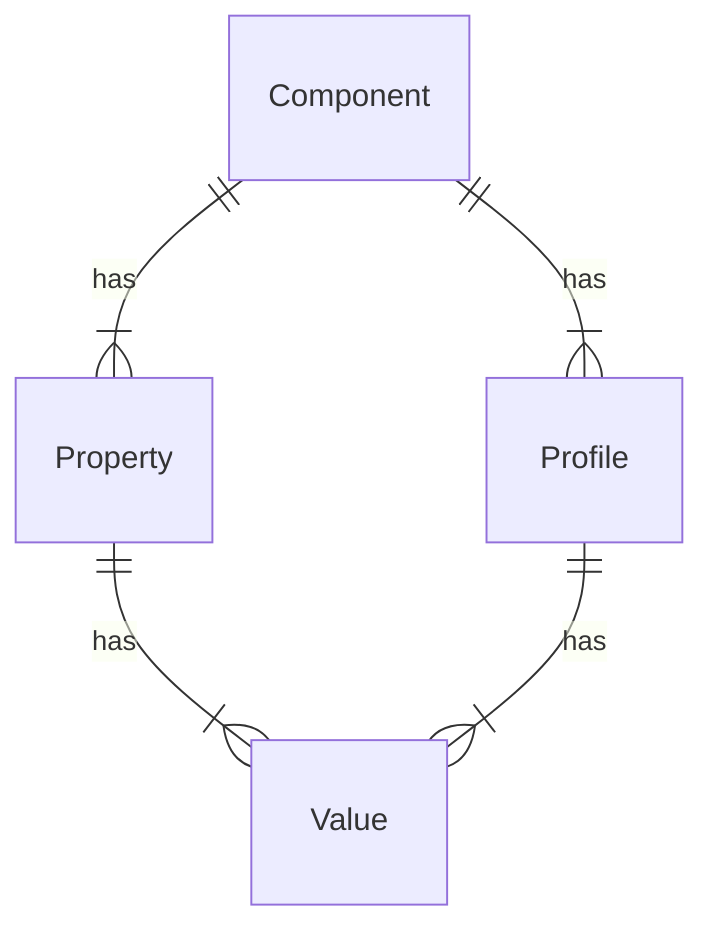

# Overview

This engine provides device detection capabilities using a high performance 
on-premise algorithm we refer to as the 
[hash](http://51degrees.com/documentation/4.4/_device_detection__hash.html)
algorithm.

This engine also requires a hash data file, which comes in three variations:

- **Lite** - Freely available from [GitHub](https://github.com/51Degrees/device-detection-data).
  Contains a highly restricted set of properties and will only be updated 
  around once per month.
- **Enterprise** - Downloaded from 
  [Distributor](http://51degrees.com/documentation/4.4/_info__distributor.html). 
  Requires a license key and is usually updated Monday-Thursday. Includes all 
  properties except TAC.
- **TAC** - Same as enterprise except that TAC is included in the result.

# Native component

In all languages, the on-premise device detection engine passes the actual
detection processing to a native dll/so library that is written in C/C++.

The intention was that this will ensure the best performance for the most 
computationally complex part of the process and reduce maintenance overhead,
as well as the time required to add support for device detection in a new 
language.

The code for this component is available on GitHub:

- [common-cxx](https://github.com/51Degrees/common-cxx)
- [device-detection-cxx](https://github.com/51Degrees/device-detection-cxx)

Unfortunately, while calling a native dll is possible in many languages, it
is often fiddly and may come with unexpected difficulties. As such, we generally 
use [SWIG](https://www.swig.org/) to help produce a wrapper for the target 
language.

## Selecting the correct binary

While the implementor is not expected to produce the CI/CD scripts that 
will create the final packages, attention must be given to how the final
package will determine the correct native binary to use based on the current
operating system.

In some cases, this capability is built into the packaging infrastructure 
(For example, .NET/NuGet). Some require additional code to be written to 
determine the correct binary at runtime (Java/Maven and Node/NPM). Others 
do not allow native binaries in packages at all (PHP/Composer).

## Reference implementation notes

The reference implementations bundle the cxx code in with the Java/.NET 
code and build it all together. This works well enough, but does come
with the downside of adding significant complexity to the build process 
for customers who may just be able to consume pre-built native binaries.

For future implementations, we recommend exploring the possibility of
moving the native binary and target language wrapper to a separate 
repository and package from the target language device detection engine 
logic.

# Accepted evidence 

This engine determines the accepted evidence keys on data refresh based
on the values in the data source.

After loading the data source into the native code, call the `getKeys` 
function to return a list of the accepted evidence keys.
These values should then be stored to prevent repeated calls to the
native code.

This must be done at startup and any time the data is refreshed.

Note that the list of accepted evidence keys is not case-sensitive.
I.e. `header.user-agent` and `header.User-Agent` should both be 
accepted.

# Element data

# Startup activity

# Processing

# Refresh data

# Events

# Metadata

## Overview

On-premise device detection has two related metadata structures:
1. The device detection data file includes metadata relating to the structure of the 
   values that are stored in the file. This is exposed by the device detection engine 
   in order to allow users to query the data. \*
2. All flow elements expose a list of metadata relating to properties populated by 
   that element. In the case of the device detection engine, this list will include 
   property metadata derived from the data file metadata mentioned above. 

\* Note that, due to the structure of the data, this is not intended to support 
high-performance querying scenarios. For that use-case, customers are directed to our 
'csv' data file, which can be consumed and stored in a database or whatever other form 
is required for querying. 

## Component

A **component** defines a group of **properties** that are related.

In a 51Degrees data set, each **property** can only be related to one **component**. 
For example, the `Browser Name` **property** is part of the `Software` **component**, 
whereas the `Model Name` **property** is part of the `Hardware` **component**.

The metadata associated with a **component** is:

| Metadata | Description |
| -------- | ----------- |
| Id       | The unique id of the **component**. This is a number and will remain the same when a data file is updated. |
| Name     | The name of the **component** that gives a more 'human' identifier than id. By convention, this is unique within the data file. |
| Default profile| The default **profile** for the **component**. This is used to provide **values** for the **component's** **properties** when a **profile** matching the @evidence cannot be found. |
| Properties| The **properties** associated with this **component**. |

## Property

The **properties** exposed by the device detection engine contain more information 
than that which is defined by the standard **property metadata** interface.
In addition to the usual information, the following must be made available:

| Metadata | Description |
| -------- | ----------- |
| Description| A description of the **property** explaining what it refers to, and what significance its values have. |
| URL      | A URL where more information on the **property** can be found. |
| Component| The **component** to which the **property** belongs. This is subtly different from the category, in that a **profile** defines the values for all the **properties** of a single **component**, which likely contains multiple categories of **properties**. |
| Values   | The **values** that the **property** can have. As a simple example, a **property** named ``'IsSmartPhone'`` might have three values: ``true``, ``false``, and ``unknown``.|
| Default Value| The default **value** for the **property** if it is not otherwise known. In the above example, the **property** named ``'IsSmartPhone'`` would probably have ``unknown`` as the default value. |
| List     | Whether or not the **property** may have multiple values. For example, the connectivity types a device supports would be a list, as a single device might support Bluetooth, HSDPA, LTE, Wi-Fi, etc. |
| Obsolete | Whether the **property** is obsolete and only exists to maintain backward compatibility. |
| Display Order| The suggested order in which to display the **property** when listing **properties**. |
| Mandatory| Whether the **property** is mandatory or not. If a **property** is mandatory, a **profile** must have a non-default value for it to be classed as valid. |
| Show     | Whether the **property** should be displayed in situations such as a page listing **properties**. Less important **properties** may not be displayed. |
| Show Values| Whether values of the **property** should be displayed in situations such as a page listing the **property's** values. Showing all the values can make a very long list. |

## Profile

A **profile** defines a unique set of **values** for all **properties** of 
a single **component**. 

| Metadata | Description |
| -------- | ----------- |
| Id       | The unique id of the **profile**. This is usually a number and will remain the same when a data file is updated. |
| Name     | The name of the **profile** that gives a more 'human' identifier than id, usually describing what the **values** it contains are. By convention, this is unique within the data file. |
| Component| The **component** to which the **profile** relates. This is the **component** which the **profile** contains **values** for. |
| Values   | The **values** that define the **profile**. |

## Value

Each **property** has a set of possible **values** that it can return.
The metadata associated with a **value** is:

| Metadata | Description |
| -------- | ----------- |
| Name     | The **value** as a string. This uniquely identifies the **value** only within the **values** relating to the same **property**. |
| Property | The **property** to which the **value** relates. This, in combination with the name, uniquely identifies the **value** within the device detection data file. |
| Description| A description of the **value** explaining what it refers to, and what it means if a **profile** has this **value**. |
| URL      | A URL where more information on the **value** can be found. |

## Match metric properties

In addition to the 'standard' device detection properties, there are a set of 
properties that return details about the processing that was performed and 
the match that was found. Metadata for these properties must be added, as they 
will not be included in the metadata exposed by the native code.

All these properties have the following values:
- Category = "Device Metrics"
- Available With = "Lite", "Premium", "Enterprise", "TAC" - If possible, this 
  list should be created dynamically from the lists of files included against 
  all other property metadata that is exposed by the native code.
- Component = "Metrics" - This component must also be added to the list of 
  components returned by the engine.

|Name|Type|Default value|Description|Possible values|
|---|---|---|---|---|
|MatchedNodes|int|0|Indicates the number of hash nodes matched within the evidence.|n/a|
|Difference|int|0|Used when detection method is not Exact or None. The larger the value the less confident the detector is in this result.|n/a|
|Drift|int|0|Total difference in character positions between where the substring's hashes were found and where they were expected.|n/a|
|DeviceId|string|"0-0-0-0"|Contains the profile ids of the matching profiles, separated by a hyphen symbol. For example \[HardwareId\]-\[PlatformId\]-\[BrowserId\]-\[CrawlerId\]. By convention, these will be in component Id order. There will often be 4 ids present, but this is not guaranteed.|n/a|
|UserAgents|string|"n/a"|The matched User-Agents.|n/a|
|Iterations|int|0|The number of iterations carried out in order to find a match. This is the number of nodes in the graph which have been visited.|n/a|
|Method|string|"NONE"|The method used to determine the match result.|"NONE", "PERFORMANCE", "COMBINED", "PREDICTIVE"|

# Configuration options

| **Parameter** | **User configurable** | **Optional** | **Default** | **Notes** |
|---|---|---|---|---|
|  |  |  |  | |

# Performance guidance

