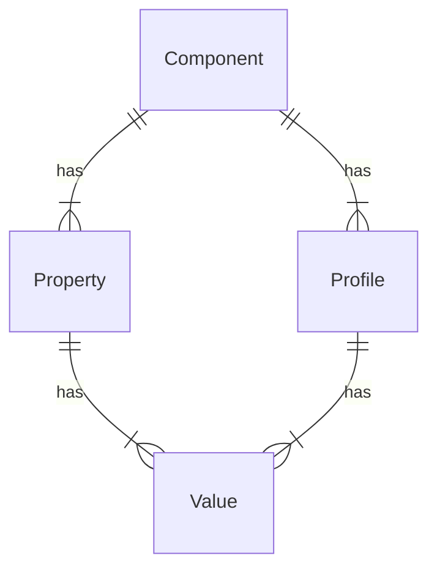

# Device Detection on-premise

## Overview

This Engine provides Device Detection capabilities using a high performance
on-premise algorithm we refer to as the
[hash](http://51degrees.com/documentation/_device_detection__hash.html)
algorithm.

This Engine also requires a hash data file, which comes in three variations:

- **Lite** - Freely available from [GitHub](https://github.com/51Degrees/device-detection-data).
  Contains a highly restricted set of Properties and is updated
  around once per month.
- **Enterprise** - Downloaded from
  [Distributor](http://51degrees.com/documentation/_info__distributor.html).
  Requires a license key for download and is usually updated Monday-Thursday. Includes all
  Properties except TAC.
- **TAC** - Same as enterprise except that TAC is included in the result.

## Native component

In all languages, the on-premise Device Detection Engine passes the actual
detection processing to a native DLL/so library that is written in C/C++.

The intention was that this will ensure the best performance for the most
computationally complex part of the process and reduce maintenance overhead,
as well as the time required to add support for Device Detection in a new
language.

The code for this component is available on GitHub:

- [common-cxx](https://github.com/51Degrees/common-cxx)
- [device-detection-cxx](https://github.com/51Degrees/device-detection-cxx)

Unfortunately, while calling a native library is possible in many languages, it
is often fiddly and may come with unexpected difficulties. As such, we generally
use [SWIG](https://www.swig.org/) to help produce a wrapper for the target
language. This takes care of the marshalling of data structures to and from
C data structures but represents a performance overhead - see
[Performance Guidance](#performance-guidance) below.

The C library is distributed in binary form for a restricted set of target
environments [tested versions](https://51degrees.com/documentation/_info__tested_versions.html),
with a number of assumptions about the availability
of [dependencies](https://51degrees.com/documentation/_info__dependencies.html).

### Selecting the correct binary

While the implementor is not expected to produce the CI/CD scripts that
will create the final packages, attention must be given to how the final
package will determine the correct native binary to use based on the current
operating system.

In some cases, this capability is built into the packaging infrastructure
(For example, .NET/NuGet). Some require additional code to be written to
determine the correct binary at runtime (Java/Maven and Node/NPM). Others
do not allow native binaries in packages at all (PHP/Composer).

### Reference implementation notes

The reference implementations bundle the cxx code in with the Java/.NET
code and build it all together. This works well enough, but does come
with the downside of adding significant complexity to the build process
for customers who may just be able to consume pre-built native binaries.

For future implementations, we recommend exploring the possibility of
moving the native binary and target language wrapper to a separate
repository and package from the target language Device Detection Engine
logic.

## Accepted Evidence

This Engine determines the accepted Evidence keys on data refresh based
on values in the data source.

After loading the data source into the native code, call the `getKeys`
function to return a list of the accepted Evidence keys.
These values should then be stored to prevent repeated calls to the
native code.

This must be done at start-up and any time the data is refreshed.

Note that the list of accepted Evidence keys is not case-sensitive -
i.e. `header.user-agent` and `header.User-Agent` should both be
accepted.

## Element Data

The list of Properties that can be populated by this Engine is determined
on data refresh based on the Properties that are available in the data
source that is used.

In addition, several additional [match metrics](#match-metric-properties)
Properties must be added as well. The table below shows the native
function to call to get the value for each Property.

| Name         | Function on result object to call to get value [^nb] |
|--------------|------------------------------------------------------|
| MatchedNodes | getMatchedNodes                                      |
| Difference   | getDifference                                        |
| Drift        | getDrift                                             |
| DeviceId     | getDeviceId                                          |
| UserAgents   | getUserAgents                                        |
| Iterations   | getIterations                                        |
| Method       | getMethod                                            |

[^nb] Note that the native implementations have some additional complexity
in their code because of a plan to split Device Detection into 4
separate Engines. This is not necessary in new implementations.

It is essential that the Element Data instance populated by this
On-premise Engine is interface compatible with the Element Data
populated by the [cloud Device Detection Engine](device-detection-cloud.md)
as well as the individual devices populated in the Element Data from
the [hardware profile lookup Engine](hardware-profile-lookup-cloud.md).

## Start-up activity

On start-up, the native Engine needs to be created using the data file.
Several functions must then be called to get the data that will be needed
by other Engine features.

See [refresh data](#refresh-data) for details on this process.

## Processing

This section describes the core steps this Engine executes to process
Flow Data. This is on top of any common processing defined for
other Pipeline API features.

- Create and populate the native Evidence object
  - The Evidence values will typically need to be converted to a memory
    format that can be used by the native Cxx code.
  - First, create a new `EvidenceDeviceDetection` C++ instance.
  - Next, add items from the Flow Data Evidence to the C++ instance.
    - Only need to add entries that the Engine will make use of.
- Call the `process` function on the native Engine, passing the native
  Evidence instance.
- This will return a `ResultsHash` instance, which contains references to
  the resulting Property values.
- Create a new instance of the implementation of the `IDeviceData` interface
  that is being used for the On-premise Engine.
  - Pass the `ResultsHash` instance so it can be used when Property values
    are requested.
  - Do not immediately copy all the Property values from `ResultsHash`. By
    default, around 200 Properties will be populated, meaning 200+ calls to
    the native code marshalling values back and forth [^caching].

[^caching] Note the effect that
holding the "unmanaged" memory references (i.e. memory references that
are not handled by language garbage collection) has on
[caching](../../pipeline-specification/features/caching.md) and
[resource cleanup](../../pipeline-specification/features/resource-cleanup.md).
The reference implementations don't allow a cache to be
added to this Engine because of the complexity this introduces, however
end-users may be tempted to create their own cache of results.

### Performance guidance

We have found that the main performance bottleneck is usually the process
of marshalling data values to and from native representations.

As such, this should be minimized as much as possible:

- Languages often have many mechanisms for passing data in calls
  to native binaries, some more efficient than others. SWIG code will
  sometimes use the most flexible approach, rather than the most performant.
  It is worth checking the generated code for relatively easy performance
  wins.
- Whenever making a call to native code, be aware of the data that is being
  passed and check if there is anything that can be done to reduce it.
- Finally, do not call native code at all if it can be avoided. For example, any
  values that will only change after a [data refresh](#refresh-data) should
  be stored in the Engine instance to avoid native calls for that value until
  a refresh occurs. Not the possible clean-up consequences that this implies.

## Refresh data

The [refresh data function](../../pipeline-specification/features/data-updates.md#aspect-engine-features)
for this Engine must perform the following tasks:
- Create a new instance of the C++ `EngineHashSwig` type using either the
  filename or byte[] constructor.
- Call `refreshData` on the C++ Engine in order to load data into the
  relevant data structures.
- Call the necessary functions on the C++ Engine in order to acquire
  metadata about the Engine that is dependent on the data file:
  - [accepted Evidence](#accepted-evidence)
  - [Properties](#property)
  - [additional Device Detection metadata](#metadata)
  - data file publish date
  - expected publish date of next data file
  - data file type
  - data file temp path

The following table lists the C++ Engine functions to call to get the data
mentioned above:

| Function name            | Notes                                                                                                                                                                                              |
|--------------------------|----------------------------------------------------------------------------------------------------------------------------------------------------------------------------------------------------|
| `getKeys`                | Get a list of the Evidence keys that the data file will make use of                                                                                                                                |
| `getMetaData`            | Get [metadata](#metadata) from the data file                                                                                                                                                      |
| `getPublishedTime`       | Get the date/time that the data file was created                                                                                                                                                   |
| `getUpdateAvailableTime` | Get the data/time that a new data file is expected to be available                                                                                                                                 |
| `getProduct`             | Get the string type of the data file. This is used by the [data update](../../pipeline-specification/features/data-updates.md) functionality when calling Distributor to check for a new data file |
| `getDataFileTempPath`    | Get the path to the temporary working copy of the data file (This is the full path to the copy of the data file that the C code makes before reading it.)                                          |

## Events

This Engine should implement the following events/callbacks/hooks:

| Name             | Notes                                                                       |
|------------------|-----------------------------------------------------------------------------|
| Refresh complete | Used by client to perform some action after a new data file has been loaded |

## Metadata

### Overview

On-premise Device Detection has two related metadata structures:
1. The Device Detection data file includes metadata relating to the structure of the
   values that are stored in the file. This is exposed by the Device Detection Engine
   in order to allow users to query the data. [^performance]
2. All Flow Elements expose a list of metadata relating to Properties populated by
   that element. In the case of the Device Detection Engine, this list will include
   Property metadata derived from the data file metadata mentioned above.

[^performance] Note that, due to the structure of the data, this is not intended to support
high-performance querying scenarios. For that use-case, customers are directed to our
'csv' data file, which can be consumed and stored in a database or whatever other form
is required for querying.

### Component

A **Component** defines a group of Properties that are related.

In a 51Degrees data set, each Property can only be related to one Component.
For example, the `Browser Name` Property is part of the `Software` Component,
whereas the `Model Name` Property is part of the `Hardware` Component.

The metadata associated with a Component is:

| Metadata        | Description                                                                                                                                                                         |
|-----------------|-------------------------------------------------------------------------------------------------------------------------------------------------------------------------------------|
| Id              | The unique id of the Component. This is a number and will remain the same when a data file is updated.                                                                          |
| Name            | The name of the Component that gives a more 'human' identifier than id. By convention, this is unique within the data file.                                                     |
| Default profile | The default Profile for the Component. This is used to provide Values for the Component's Properties when a Profile matching the @Evidence cannot be found. |
| Properties      | The Properties associated with this Component.                                                                                                                              |

### Property

The **Properties** exposed by the Device Detection Engine contain more information
than that which is defined by the standard Property metadata interface.
In addition to the usual information, the following must be made available:

| Metadata      | Description                                                                                                                                                                                                                                                  |
|---------------|--------------------------------------------------------------------------------------------------------------------------------------------------------------------------------------------------------------------------------------------------------------|
| Description   | A description of the Property explaining what it refers to, and what significance its values have.                                                                                                                                                       |
| URL           | A URL where more information on the Property can be found.                                                                                                                                                                                               |
| Component     | The Component to which the Property belongs. This is subtly different from the category, in that a Profile defines the values for all the Properties of a single Component, which likely contains multiple categories of Properties. |
| Values        | The Values that the Property can have. As a simple example, a Property named ``'IsSmartPhone'`` might have three values: ``true``, ``false``, and ``unknown``.                                                                                   |
| Default Value | The default Value for the Property if it is not otherwise known. In the above example, the Property named ``'IsSmartPhone'`` would probably have ``unknown`` as the default value.                                                               |
| List          | Whether or not the Property may have multiple values. For example, the connectivity types a device supports would be a list, as a single device might support Bluetooth, HSDPA, LTE, Wi-Fi, etc.                                                         |
| Obsolete      | Whether the Property is obsolete and only exists to maintain backward compatibility.                                                                                                                                                                     |
| Display Order | The suggested order in which to display the Property when listing Properties.                                                                                                                                                                        |
| Mandatory     | Whether the Property is mandatory or not. If a Property is mandatory, a Profile must have a non-default value for it to be classed as valid.                                                                                                     |
| Show          | Whether the Property should be displayed in situations such as a page listing Properties. Less important Properties may not be displayed.                                                                                                        |
| Show Values   | Whether values of the Property should be displayed in situations such as a page listing the Property's values. Showing all the values can make a very long list.                                                                                     |

### Profile

A **Profile** defines a unique set of Values for all Properties of
a single Component.

| Metadata  | Description                                                                                                                                                                           |
|-----------|---------------------------------------------------------------------------------------------------------------------------------------------------------------------------------------|
| Id        | The unique id of the Profile. This is usually a number and will remain the same when a data file is updated.                                                                      |
| Name      | The name of the Profile that gives a more 'human' identifier than id, usually describing what the Values it contains are. By convention, this is unique within the data file. |
| Component | The Component to which the Profile relates. This is the Component which the Profile contains Values for.                                                          |
| Values    | The Values that define the Profile.                                                                                                                                           |

### Value

Each Property has a set of possible **Values** that it can return.
The metadata associated with a Value is:

| Metadata    | Description                                                                                                                                                   |
|-------------|---------------------------------------------------------------------------------------------------------------------------------------------------------------|
| Name        | The Value as a string. This uniquely identifies the Value only within the Values relating to the same Property.                               |
| Property    | The Property to which the Value relates. This, in combination with the name, uniquely identifies the Value within the Device Detection data file. |
| Description | A description of the Value explaining what it refers to, and what it means if a Profile has this Value.                                           |
| URL         | A URL where more information on the Value can be found.                                                                                                   |

### Match metric Properties

In addition to the 'standard' Device Detection Properties, there are a set of
Properties that return details about the processing that was performed and
the match that was found. Metadata for these Properties must be added, as they
will not be included in the metadata exposed by the native code.

All these Properties have the following values:
- Category = "Device Metrics" (sic)
- Available With = "Lite", "Premium", "Enterprise", "TAC" - If possible, this
  list should be created dynamically from the lists of files included against
  all other Property metadata that is exposed by the native code.
- Component = "Metrics" - This component must also be added to the list of
  components returned by the Engine.

| Name             | Type   | Default value | Description                                                                                                                                                                                                                                                                | Possible values                                 |
|------------------|--------|---------------|----------------------------------------------------------------------------------------------------------------------------------------------------------------------------------------------------------------------------------------------------------------------------|-------------------------------------------------|
| MatchedNodes     | int    | 0             | Indicates the number of hash nodes matched within the Evidence.                                                                                                                                                                                                            | n/a                                             |
| Difference       | int    | 0             | Used when detection method is not Exact or None. The larger the value the less confident the detector is in this result.                                                                                                                                                   | n/a                                             |
| Drift            | int    | 0             | Total difference in character positions between where the substring's hashes were found and where they were expected.                                                                                                                                                      | n/a                                             |
| DeviceId         | string | "0-0-0-0"     | Contains the profile ids of the matching profiles, separated by a hyphen symbol. For example \[HardwareId\]-\[PlatformId\]-\[BrowserId\]-\[CrawlerId\]. By convention, these will be in component Id order. There will often be 4 ids present, but this is not guaranteed. | n/a                                             |
| MatchingEvidence | string | "n/a"         | The matched User-Agents.                                                                                                                                                                                                                                                   | n/a                                             |
| Iterations       | int    | 0             | The number of iterations carried out in order to find a match. This is the number of nodes in the graph which have been visited.                                                                                                                                           | n/a                                             |
| Method           | string | "NONE"        | The method used to determine the match result.                                                                                                                                                                                                                             | "NONE", "PERFORMANCE", "COMBINED", "PREDICTIVE" |

## Configuration options

These are the configuration options that are unique to this Engine. They are in
addition to all the configuration options defined for other features. For example,
[data updates](../../pipeline-specification/features/data-updates.md#configuration-groups)

| **Parameter**             | **Native code location**                                                                                                                            | **Optional** | **Default**                                                                                                                      | **Notes**                                                                                                                                                                                                                                                                                                                                                                                                   |
|---------------------------|-----------------------------------------------------------------------------------------------------------------------------------------------------|--------------|----------------------------------------------------------------------------------------------------------------------------------|-------------------------------------------------------------------------------------------------------------------------------------------------------------------------------------------------------------------------------------------------------------------------------------------------------------------------------------------------------------------------------------------------------------|
| Difference                | [ConfigHash::setDifference()](https://github.com/51Degrees/device-detection-cxx/blob/main/src/hash/ConfigHash.hpp#L139)                             | Yes          | Native code [^1]                                                                                                                 | Used to set the maximum [difference](https://51degrees.com/documentation/_device_detection__hash.html#difference) in hash value to allow when processing HTTP headers.                                                                                                                                                                                                                                  |
| Drift                     | [ConfigHash::setDrift()](https://github.com/51Degrees/device-detection-cxx/blob/main/src/hash/ConfigHash.hpp#L147)                                  | Yes          | Native code [^1]                                                                                                                 | Used to set the maximum [drift](https://51degrees.com/documentation/_device_detection__hash.html#drift) in hash position to allow when processing HTTP headers.                                                                                                                                                                                                                                         |
| Allow Unmatched           | [ConfigDeviceDetection::setAllowUnmatched()](https://github.com/51Degrees/device-detection-cxx/blob/main/src/ConfigDeviceDetection.hpp#L108)        | Yes          | Native code [^1]                                                                                                                 | If no match is found for the Evidence value then this controls how the Property values will be populated in the result. If set to false, Properties will not have set values. If set to true, Property values will be set from the default [profile](#profile) for that component. This means that Properties will always have values (i.e. no need to check .HasValue) but some may be inaccurate. |
| Reuse Operational File    | [ConfigBase=>setReuseTempFile()](https://github.com/51Degrees/common-cxx/blob/main/ConfigBase.hpp#L104)                                             | Yes          | Native code [^1]                                                                                                                 | Set whether or not an existing operational file should be used if one is found in the temp directory.                                                                                                                                                                                                                                                                                                       |
| Update Matched User Agent | [ConfigDeviceDetection::setUpdateMatchedUserAgent()](https://github.com/51Degrees/device-detection-cxx/blob/main/src/ConfigDeviceDetection.hpp#L91) | Yes          | Native code [^1]                                                                                                                 | Set whether or not the result should include the characters from the Evidence values that were used to find a match. If set, this will be available from the 'MatchingEvidence' [match metric](#match-metric-properties) Property. This is optional because it adds some overhead that is not necessary in normal operation.                                                                                |
| Use Performance Graph     | [ConfigHash::setUsePerformanceGraph()](https://github.com/51Degrees/device-detection-cxx/blob/main/src/hash/ConfigHash.hpp#L159)                    | Yes          | Native code [^1]                                                                                                                 | Set whether or not to use the [performance](https://51degrees.com/documentation/_device_detection__hash.html#performance-graphs) graph when attempting to match Evidence values.                                                                                                                                                                                                                        |
| Use Predictive Graph      | [ConfigHash::setUsePredictiveGraph()](https://github.com/51Degrees/device-detection-cxx/blob/main/src/hash/ConfigHash.hpp#L170)                     | Yes          | Native code [^1]                                                                                                                 | Set whether or not to use the [predictive](https://51degrees.com/documentation/_device_detection__hash.html#predictive-graphs) graph when attempting to match Evidence values.                                                                                                                                                                                                                          |
| Performance Profile       | [ConfigHash=>set\[ProfileName\]()](https://github.com/51Degrees/device-detection-cxx/blob/main/src/hash/ConfigHash.hpp#L104)                        | Yes          | Balanced. See [native code](https://github.com/51Degrees/device-detection-cxx/blob/master/src/hash/hash.c#L175) for definitions. | Set the performance profile to use when creating the Engine. Each profile has default values for various internal configuration options, as well as things like the use of predictive/performance graphs.                                                                                                                                                                                                   |
| Concurrency               | [ConfigHash::setConcurrency()](https://github.com/51Degrees/device-detection-cxx/blob/main/src/hash/ConfigHash.hpp#L180)                            | Yes          | System processor count                                                                                                           | Set the expected number of concurrent operations using the Engine. This is used to configure internal caches to avoid excessive locking. It has no effect if these internal caches are not used. (For example, when using the 'MaxPerformance' profile)                                                                                                                                                     |

[^1]: The default values for many configuration options comes from the native
C/C++ code. You can find these defaults in the following files:
- https://github.com/51Degrees/common-cxx/blob/master/config.h
- https://github.com/51Degrees/device-detection-cxx/blob/master/src/config-dd.h

