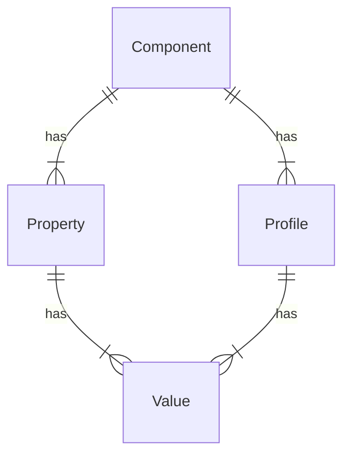

# Automated Testing

Device Detection automated testing follows the guidelines set out in
[Pipeline Automated
Testing](../../pipeline-specification/part3/automated-testing.md) and
the general comments made there are not usually repeated here.

## Device Detection Cloud Engine

Testing of several parts of the operation of the Cloud Engine may
require access to a remote server and hence the tests may appear more as
integration tests than unit tests.

The Java reference implementation doesn't provide a stub server and
doesn't approach testing by processing of canonical JSON examples, so
does require a remote server. Some parts of testing are carried out
using mocks.

-   Test for correct return of values with known Resource Key
-   Test for correct operation when Resource Key doesn't contain correct
    Properties
-   Test for correct operation on transient network failure

General tests - Test for correct operation when data is not available in
this tier - Test for availability of typed getters for Properties - Test
for correct operation of Evidence keys

## Device Detection On-premise Engine

Carry out similar tests to Cloud Engine, in addition - Test for correct
operation of SWIG - Test for correct operation of performance
configuration - Test for correct operation of data tier

## Examples

Testing of examples is strongly recommended, at least to assess whether
they compile and can be run. It's usually not practical to assess the
correctness of any output from tests of examples.

# Required Examples

## Features

It is recommended that the following features are demonstrated in
examples:

-   On-Premise Device Detection
-   Cloud Device Detection
-   Native Key/TAC Detection
-   Build from Configuration
-   Use of Fluent Builder
-   Need for Resource Key for Cloud
-   Creation of Pipeline once only
-   Presentation of Evidence
-   Access to Properties strongly typed
-   Need to dispose every Flow Data
-   Match Metrics
-   Use of Web Integration
-   Use of Client Side detection
-   Obtaining "high entropy" Evidence
-   Offline Processing
-   Data Update

The examples in the reference implementations demonstrate combinations
of the above features - see [Concrete Examples](#concrete-examples).

## Implementation Notes

### Execution

It is recommended that examples are simply executable from an IDE, so
examples should be runnable in such a context.

It is recommended that unit tests be provided for examples, to verify
that the example remains valid though various code changes. Since
examples are primarily concerned with providing visual output at the
time of execution it is often difficult to carry out verification of the
results produced by the example, and it is likely to be sufficient for a
test to show that the example runs and completes without failure.

The need for examples to be runnable as an application and as a test
suggests that they are written with example code to be executed as a
public method, and a pattern may be established across examples.

### Legibility

It is of importance for examples to illustrate key features of the APIs
in a simple way. For this reason, reference implementations use a number
of helper functions to simplify the code so as not to obscure the points
being illustrated. In creating the examples, 51Degrees found that there
is a trade-off between helper functions hiding unimportant details, and
helper functions hiding awkwardness of access to certain features.

Implementors may wish to consider adding those helper functions to their
API implementations, rather than them being accessible only in the
context of examples.

Some examples of helpers in the latter category: - a helper that creates
a hash Engine to provide access to the data file metadata (date and data
tier). - a helper that gets the value of a Property as a string, taking
into account that a value may not exist or that it may be a list.

### Code Comments

We recommend extremely verbose and pedagogic comments as a module header
and in the code of examples.

51Degrees generates Web documentation ([for
example](https://51degrees.com/documentation/_examples__device_detection__getting_started__console__on_premise.html))
from reference implementation examples, using Doxygen. For the sake of
readability of the source of the examples text intended for Doxygen
generation is placed at the bottom of source files.

### File References

Finding a path to files used by examples may not be completely
straightforward, as the example may have been downloaded from GitHub, or
if it's part of the standard distribution of the API files, it may
appear at different relative paths to the current working directory when
the example is executed - especially when executed as an automated test
as opposed to being run from an IDE.

In the Java reference implementation the [FileFinder
utility](https://github.com/51Degrees/pipeline-java/blob/master/pipeline.core/src/main/java/fiftyone/pipeline/util/FileFinder.java)
is used to locate the file.

### Test Data

Many examples require test data consisting of HTTP Header Evidence -
User Agent and UserAgent Client Hints. A YAML file containing 20,000
sets of such Evidence is distributed as one of the Git submodules
referenced from on-premise Hash detection. It is also available in a
repository in
[GitHub](https://github.com/51Degrees/device-detection-data) where it is
updated on a monthly basis.

See [File References](#file-references) for a discussion of locating
files.

### On-Premise Device Detection

Reference implementation examples illustrate use of the Lite Data File
that is distributed as one of the Git submodules referenced from
on-premise Hash detection. It is also updated in
[GitHub](https://github.com/51Degrees/device-detection-data) on a
monthly basis.

See [File References](#file-references) for a discussion of locating
files.

In the reference implementations it is stressed in comments as well as
in the output of examples that the Lite data file has a small number of
Properties.

The production date of the file in use is noted and a warning reported
if it is more than 28 days old. This serves also to illustrate how to
find the production date of the file.

### Cloud Device Detection

Reference implementation examples illustrate use of Resource Keys to
access the cloud service. A predefined link [such
as](https://configure.51degrees.com/jqz435Nc) can be created to create a
Resource Key to provide access to the Properties used in the examples.
For simplicity, it may be convenient for such a link to provide access
to all free Properties.

Since the Resource Key is shared between several examples, it may be
convenient for it to be set as an environment variable, rather than
passing as a command argument, especially given the need for examples to
be executed in a test environment.

### Fluent Builders

Reference implementation examples demonstrate the use of the simplified
top-level builder for cloud and on-premise. Noting that
[elsewhere](../../pipeline-specification/reference-implementation-notes.md)
we recommend considering the trade-off between the apparent simplicity
of this approach and some disadvantages.

Additionally, assuming default values are needed this does simplify the
examples. However, it has the disadvantage that users may not understand
how to use the Pipeline builder and the various Engine builders in
concert, and hence may not be aware of how they can configure Properties
that are not exposed by the simplified builder, should they need to.

It is recommended that at least one example demonstrates this technique
for creating a Pipeline and that it is made clear that the lifetime of
the FlowElements added to the Pipeline should, in general, be controlled
by the Pipeline they are added to (`setAutoClose(true)`). In other
words, destruction of the Pipeline causes the elements added to it to be
destroyed.

It is recommended that examples make reference to the options available
and their default values in a Git submodule (and see below regarding an
example XML options file containing the same information as an XML
comment). [reference that submodule in GitHub]{style="color:yellow"}

### Build from Configuration

Reference implementation examples include illustration of creating a
Pipeline from a configuration file. In XML, this configuration file can
be used to add, as a comment, a listing of all the possible options for
the Pipeline and all Engines. This information is also available in a
Git submodule [reference that submodule in
GitHub]{style="color:yellow"}.

### Pipeline and Flow Data Lifecycle

Some 51Degrees support queries relate to user confusion over the
intended lifecycle of a Pipeline and Flow Data created from it.

It's important to emphasize, in examples, that only one Pipeline is
usually required in any implementation and that it can be created as a
singleton, whose lifetime is often the same as the application that it
is in.

Nevertheless, it is suggested that this lifetime be illustrated using
the equivalent of a "try-with-resources" construct, within which the
Pipeline instance is used as a factory for many Flow Data instances.

Similarly, but for a contrasting purpose, it is suggested that use of a
Pipeline as such a factory, using its `createFlowData` method, is also
illustrated with the call to that method being part of a
"try-with-resources" construct.

### ShareUsage

Since Evidence used in examples is already collected by 51Degrees there
is no value in sharing those values with 51Degrees. In addition, though
use of examples is likely to be statistically insignificant, it may
nonetheless alter the calculations that are performed regarding current
usage.

For somewhat arbitrary reasons, reference implementations inhibit usage
sharing for console examples, but enable it for web examples. Every
example in which share usage is inhibited needs to have a comment saying
that in normal operation it should not be, which diminishes the clarity
of the example.

## Concrete Examples

These examples are provided in the reference implementations to
illustrate [features](#features) mentioned.

### Getting Started Console

Examples should be provided that illustrate basic usage of the API for
both Cloud and On-Prem, using fluent builder and options file
configuration, when executed as a console application.

Detailed inline comments in these examples introduce the use of Evidence
and retrieval of Properties resulting from detection, as well as
illustrating correct [lifecycle
management](#pipeline-and-flowdata-lifecycle) of Pipeline and Flow Data
instances.

See documentation
[cloud](https://51degrees.com/documentation/_examples__device_detection__getting_started__console__cloud.html),
[on-premise](https://51degrees.com/documentation/_examples__device_detection__getting_started__console__on_premise.html)

### Getting Started Web

These examples illustrate use of [Web
integration](../../pipeline-specification/features/web-integration.md)
for both Cloud and On-Premise by creating a Web page that can be
accessed from a web server running in the example environment that is
created during execution of the example.

The example also illustrates the availability of Device Detection
Properties from client-side JavaScript as well as illustrating use of
JavaScript to collect Evidence directly from the client and present it
to the server.

The example should illustrate various techniques for obtaining "high
entropy values" for presentation to the origin server as well as to the
51degrees cloud service. See [Implementing User Agent Client
Hints](https://51degrees.com/blog/implementing-user-agent-client-hints).

There is a wide choice of server-side Web frameworks, the reference
implementations illustrate basic ASP.NET Core and ASP.NET Framework
usage for C# and basic Servlet usage in Java.

See documentation
[cloud](https://51degrees.com/documentation/_examples__device_detection__getting_started__web__cloud.html),
[on-premise](https://51degrees.com/documentation/_examples__device_detection__getting_started__web__on_premise.html)

### TAC / Native Key Lookup

These examples illustrate retrieval of device data from the cloud
service using either TAC or native model name.

These examples require the user to obtain a license key in order to
configure an appropriate Resource Key.

See documentation
[TAC](https://51degrees.com/documentation/_examples__device_detection__tac_lookup__cloud.html),
[Native
key](https://51degrees.com/documentation/_examples__device_detection__native_key_lookup__cloud.html)

### Match Metrics

On-premise detection provides access to various metrics that provide
insight into the detection process and confidence in the output. A key
point of this example is to illustrate that reducing the number of
Properties requested can reduce the time for detection.

[See
documentation](https://51degrees.com/documentation/_examples__device_detection__match_metrics__on_premise_hash.html)

### Metadata

It is recommended that implementors illustrate the retrieval of Evidence
keys, Properties, components and profiles from the on-premise, and
Properties and Evidence keys for cloud.

See documentation
[on-premise](https://51degrees.com/documentation/_examples__device_detection__metadata__on_premise_hash.html),
[cloud](https://51degrees.com/documentation/_examples__device_detection__metadata__cloud.html).

### Performance Options

Reference implementations contain an "Offline Processing" example which
illustrates the processing of a batch file. The example also shows the
various performance options available (Low Memory, Predictive Graph,
etc.) which are commented out in the example.

Implementors might consider illustrating the differences between the
various combinations of options.

[See
documentation](https://51degrees.com/documentation/_examples__device_detection__offline_processing__on_premise_hash.html)

### Performance Benchmark

Reference implementations contain a Performance Benchmark which is
somewhat similar to the ["Offline Processing"
example](#performance-options).

[See
documentation](https://51degrees.com/documentation/_examples__device_detection__performance__on_premise_hash.html)
Java tab.

### Data Update

Examples should illustrate updating an on-premise data source both by
access to remote servers and by direct update of a file store location.

The data update service has a range of options available. Implementors
should illustrate:

-   file system watcher
-   remote update polling
-   update on start-up
-   programmatic (non-automatic) update

[See
documentation](https://51degrees.com/documentation/_examples__device_detection__data_file_updates__automatic.html)

# Device Detection cloud

## Overview

Cloud Device Detection presents
[Evidence](../../pipeline-specification/features/evidence.md) to the
51Degrees Cloud Detection server, which carries out the detection and
returns a JSON data structure, from which Device Detection Properties
are populated in the Flow Data.

This is implemented as a two-step process: a Cloud Request Engine
presents the Evidence to the 51Degrees server with an HTTP request and
copies the JSON response into Element Data in the Flow Data.

This Element Data is passed using the standard Pipeline Flow Data
mechanism to a Device Detection Cloud Engine, later in the Pipeline.
Since the detection Engine depends on the request having been processed
in advance, it checks that Element Data from the cloud request is
present in Pipeline before processing.


The majority of the logic that is executed by the Device Detection Cloud
Engine is common to all Cloud Engines and is described in the [Cloud
Aspect
Engine](../../pipeline-specification/pipeline-elements/cloud-aspect-engine.md)
document.

## Device Detection Cloud Engine configuration

There are no configuration options associated with this Engine.

## Device Detection Cloud Engine processing

When it is added to a Pipeline, Device Detection Cloud Engine
initializes itself from a Cloud Request Engine, which MUST have been
added to the Pipeline before it.

The Cloud Request Engine determines which Properties are available based
on the Resource Key supplied on start-up. The Device Detection Cloud
Engine then takes the details of the subset of those Properties that are
relevant to Device Detection.

See [Cloud Request
Engine](../../pipeline-specification/pipeline-elements/cloud-request-engine.md)
for more details of this Engine.

# Device Detection on-premise

## Overview

This Engine provides Device Detection capabilities using a high
performance on-premise algorithm we refer to as the
[hash](http://51degrees.com/documentation/_device_detection__hash.html)
algorithm.

This Engine also requires a hash data file, which comes in three
variations:

-   **Lite** - Freely available from
    [GitHub](https://github.com/51Degrees/device-detection-data).
    Contains a highly restricted set of Properties and is updated around
    once per month.
-   **Enterprise** - Downloaded from
    [Distributor](http://51degrees.com/documentation/_info__distributor.html).
    Requires a license key for download and is usually updated
    Monday-Thursday. Includes all Properties except TAC.
-   **TAC** - Same as enterprise except that TAC is included in the
    result.

## Native component

In all languages, the on-premise Device Detection Engine passes the
actual detection processing to a native DLL/so library that is written
in C/C++.

The intention was that this will ensure the best performance for the
most computationally complex part of the process and reduce maintenance
overhead, as well as the time required to add support for Device
Detection in a new language.

The code for this component is available on GitHub:

-   [common-cxx](https://github.com/51Degrees/common-cxx)
-   [device-detection-cxx](https://github.com/51Degrees/device-detection-cxx)

Unfortunately, while calling a native library is possible in many
languages, it is often fiddly and may come with unexpected difficulties.
As such, we generally use [SWIG](https://www.swig.org/) to help produce
a wrapper for the target language. This takes care of the marshalling of
data structures to and from C data structures but represents a
performance overhead - see [Performance Guidance](#performance-guidance)
below.

The C library is distributed in binary form for a restricted set of
target environments [tested
versions](https://51degrees.com/documentation/_info__tested_versions.html),
with a number of assumptions about the availability of
[dependencies](https://51degrees.com/documentation/_info__dependencies.html).

### Selecting the correct binary

While the implementor is not expected to produce the CI/CD scripts that
will create the final packages, The final package MUST have some
mechanism to determine the correct native binary to use based on the
current operating system.

In some cases, this capability is built into the packaging
infrastructure (For example, .NET/NuGet). Some require additional code
to be written to determine the correct binary at runtime (Java/Maven and
Node/NPM). Others do not allow native binaries in packages at all
(PHP/Composer).

### Reference implementation notes

The reference implementations bundle the cxx code in with the Java/.NET
code and build it all together. This works well enough, but does come
with the downside of adding significant complexity to the build process
for customers who may just be able to consume pre-built native binaries.

For future implementations, we recommend exploring the possibility of
moving the native binary and target language wrapper to a separate
repository and package from the target language Device Detection Engine
logic.

## Accepted Evidence

This Engine determines the accepted Evidence keys on data refresh based
on values in the data source.

After loading the data source into the native code, call the `getKeys`
function to return a list of the accepted Evidence keys. These values
should then be stored to prevent repeated calls to the native code.

This MUST be done at start-up and any time the data is refreshed.

Note that the list of accepted Evidence keys is not case-sensitive -
i.e. `header.user-agent` and `header.User-Agent` should both be
accepted.

## Element Data

The list of Properties that can be populated by this Engine is
determined on data refresh based on the Properties that are available in
the data source that is used.

In addition, several additional [match
metrics](#match-metric-properties) Properties MUST be added as well. The
table below shows the native function to call to get the value for each
Property.

  Name           Function on result object to call to get value \[\^nb\]
  -------------- ---------------------------------------------------------
  MatchedNodes   getMatchedNodes
  Difference     getDifference
  Drift          getDrift
  DeviceId       getDeviceId
  UserAgents     getUserAgents
  Iterations     getIterations
  Method         getMethod

\[\^nb\] Note that the native implementations have some additional
complexity in their code because of a plan to split Device Detection
into 4 separate Engines. This is not necessary in new implementations.

It is essential that the Element Data instance populated by this
On-premise Engine is interface compatible with the Element Data
populated by the [cloud Device Detection
Engine](device-detection-cloud.md) as well as the individual devices
populated in the Element Data from the [hardware profile lookup
Engine](hardware-profile-lookup-cloud.md).

## Start-up activity

On start-up, the native Engine needs to be created using the data file.
Several functions will then be called to get the data that is needed by
other Engine features.

See [refresh data](#refresh-data) for details on this process.

## Processing

This section describes the core steps this Engine executes to process
Flow Data. This is on top of any common processing defined for other
Pipeline API features.

-   Create and populate the native Evidence object
    -   The Evidence values will typically need to be converted to a
        memory format that can be used by the native Cxx code.
    -   First, create a new `EvidenceDeviceDetection` C++ instance.
    -   Next, add items from the Flow Data Evidence to the C++ instance.
        -   Only need to add entries that the Engine will make use of.
-   Call the `process` function on the native Engine, passing the native
    Evidence instance.
-   This will return a `ResultsHash` instance, which contains references
    to the resulting Property values.
-   Create a new instance of the implementation of the `IDeviceData`
    interface that is being used for the On-premise Engine.
    -   Pass the `ResultsHash` instance so it can be used when Property
        values are requested.
    -   Do not immediately copy all the Property values from
        `ResultsHash`. By default, around 200 Properties will be
        populated, meaning 200+ calls to the native code marshalling
        values back and forth \[\^caching\].

\[\^caching\] Note the effect that holding the "unmanaged" memory
references (i.e. memory references that are not handled by language
garbage collection) has on
[caching](../../pipeline-specification/features/caching.md) and
[resource
cleanup](../../pipeline-specification/features/resource-cleanup.md). The
reference implementations don't allow a cache to be added to this Engine
because of the complexity this introduces, however end-users may be
tempted to create their own cache of results.

### Performance guidance

We have found that the main performance bottleneck is usually the
process of marshalling data values to and from native representations.

As such, this should be minimized as much as possible:

-   Languages often have many mechanisms for passing data in calls to
    native binaries, some more efficient than others. SWIG code will
    sometimes use the most flexible approach, rather than the most
    performant. It is worth checking the generated code for relatively
    easy performance wins.
-   Whenever making a call to native code, be aware of the data that is
    being passed and check if there is anything that can be done to
    reduce it.
-   Finally, do not call native code at all if it can be avoided. For
    example, any values that will only change after a [data
    refresh](#refresh-data) should be stored in the Engine instance to
    avoid native calls for that value until a refresh occurs. Not the
    possible clean-up consequences that this implies.

## Refresh data

The [refresh data
function](../../pipeline-specification/features/data-updates.md#aspect-engine-features)
for this Engine will perform the following tasks: - Create a new
instance of the C++ `EngineHashSwig` type using either the filename or
byte\[\] constructor. - Call `refreshData` on the C++ Engine in order to
load data into the relevant data structures. - Call the necessary
functions on the C++ Engine in order to acquire metadata about the
Engine that is dependent on the data file: - [accepted
Evidence](#accepted-evidence) - [Properties](#property) - [additional
Device Detection metadata](#metadata) - data file publish date -
expected publish date of next data file - data file type - data file
temp path

The following table lists the C++ Engine functions to call to get the
data mentioned above:

  -------------------------------------------------------------------------------------------
  Function name              Notes
  -------------------------- ----------------------------------------------------------------
  `getKeys`                  Get a list of the Evidence keys that the data file will make use
                             of

  `getMetaData`              Get [metadata](#metadata) from the data file

  `getPublishedTime`         Get the date/time that the data file was created

  `getUpdateAvailableTime`   Get the data/time that a new data file is expected to be
                             available

  `getProduct`               Get the string type of the data file. This is used by the [data
                             update](../../pipeline-specification/features/data-updates.md)
                             functionality when calling Distributor to check for a new data
                             file

  `getDataFileTempPath`      Get the path to the temporary working copy of the data file
                             (This is the full path to the copy of the data file that the C
                             code makes before reading it.)
  -------------------------------------------------------------------------------------------

## Events

This Engine should implement the following events/callbacks/hooks:

  -----------------------------------------------------------------------
  Name          Notes
  ------------- ---------------------------------------------------------
  Refresh       Used by client to perform some action after a new data
  complete      file has been loaded

  -----------------------------------------------------------------------

## Metadata

### Overview

On-premise Device Detection has two related metadata structures: 1. The
Device Detection data file includes metadata relating to the structure
of the values that are stored in the file. This is exposed by the Device
Detection Engine in order to allow users to query the data.
\[\^performance\] 2. All Flow Elements expose a list of metadata
relating to Properties populated by that element. In the case of the
Device Detection Engine, this list will include Property metadata
derived from the data file metadata mentioned above.

\[\^performance\] Note that, due to the structure of the data, this is
not intended to support high-performance querying scenarios. For that
use-case, customers are directed to our 'csv' data file, which can be
consumed and stored in a database or whatever other form is required for
querying.



### Component

A **Component** defines a group of Properties that are related.

In a 51Degrees data set, each Property can only be related to one
Component. For example, the `Browser Name` Property is part of the
`Software` Component, whereas the `Model Name` Property is part of the
`Hardware` Component.

The metadata associated with a Component is:

  -----------------------------------------------------------------------------
  Metadata     Description
  ------------ ----------------------------------------------------------------
  Id           The unique id of the Component. This is a number and will remain
               the same when a data file is updated.

  Name         The name of the Component that gives a more 'human' identifier
               than id. By convention, this is unique within the data file.

  Default      The default Profile for the Component. This is used to provide
  profile      Values for the Component's Properties when a Profile matching
               the @Evidence cannot be found.

  Properties   The Properties associated with this Component.
  -----------------------------------------------------------------------------

### Property

The **Properties** exposed by the Device Detection Engine contain more
information than that which is defined by the standard Property metadata
interface. In addition to the usual information, the following MUST be
made available:

  --------------------------------------------------------------------------------
  Metadata      Description
  ------------- ------------------------------------------------------------------
  Description   A description of the Property explaining what it refers to, and
                what significance its values have.

  URL           A URL where more information on the Property can be found.

  Component     The Component to which the Property belongs. This is subtly
                different from the category, in that a Profile defines the values
                for all the Properties of a single Component, which likely
                contains multiple categories of Properties.

  Values        The Values that the Property can have. As a simple example, a
                Property named `'IsSmartPhone'` might have three values: `true`,
                `false`, and `unknown`.

  Default Value The default Value for the Property if it is not otherwise known.
                In the above example, the Property named `'IsSmartPhone'` would
                probably have `unknown` as the default value.

  List          Whether or not the Property may have multiple values. For example,
                the connectivity types a device supports would be a list, as a
                single device might support Bluetooth, HSDPA, LTE, Wi-Fi, etc.

  Obsolete      Whether the Property is obsolete and only exists to maintain
                backward compatibility.

  Display Order The suggested order in which to display the Property when listing
                Properties.

  Mandatory     Whether the Property is mandatory or not. If a Property is
                mandatory, a Profile MUST have a non-default value for that
                Property in order for the Profile to be classed as valid.

  Show          Whether the Property should be displayed in situations such as a
                page listing Properties. Less important Properties may not be
                displayed.

  Show Values   Whether values of the Property should be displayed in situations
                such as a page listing the Property's values. Showing all the
                values can make a very long list.
  --------------------------------------------------------------------------------

### Profile

A **Profile** defines a unique set of Values for all Properties of a
single Component.

  ------------------------------------------------------------------------------
  Metadata    Description
  ----------- ------------------------------------------------------------------
  Id          The unique id of the Profile. This is usually a number and will
              remain the same when a data file is updated.

  Name        The name of the Profile that gives a more 'human' identifier than
              id, usually describing what the Values it contains are. By
              convention, this is unique within the data file.

  Component   The Component to which the Profile relates. This is the Component
              which the Profile contains Values for.

  Values      The Values that define the Profile.
  ------------------------------------------------------------------------------

### Value

Each Property has a set of possible **Values** that it can return. The
metadata associated with a Value is:

  -------------------------------------------------------------------------------
  Metadata      Description
  ------------- -----------------------------------------------------------------
  Name          The Value as a string. This uniquely identifies the Value only
                within the Values relating to the same Property.

  Property      The Property to which the Value relates. This, in combination
                with the name, uniquely identifies the Value within the Device
                Detection data file.

  Description   A description of the Value explaining what it refers to, and what
                it means if a Profile has this Value.

  URL           A URL where more information on the Value can be found.
  -------------------------------------------------------------------------------

### Match metric Properties

In addition to the 'standard' Device Detection Properties, there are a
set of Properties that return details about the processing that was
performed and the match that was found. Metadata for these Properties
MUST be added, as they will not be included in the metadata exposed by
the native code.

All these Properties have the following values: - Category = "Device
Metrics" (sic) - Available With = "Lite", "Premium", "Enterprise",
"TAC" - If possible, this list should be created dynamically from the
lists of files included against all other Property metadata that is
exposed by the native code. - Component = "Metrics" - This component
MUST also be added to the list of components returned by the Engine.

  ---------------------------------------------------------------------------------------------------------------------
  Name               Type     Default     Description                                                  Possible values
                              value                                                                    
  ------------------ -------- ----------- ------------------------------------------------------------ ----------------
  MatchedNodes       int      0           Indicates the number of hash nodes matched within the        n/a
                                          Evidence.                                                    

  Difference         int      0           Used when detection method is not Exact or None. The larger  n/a
                                          the value the less confident the detector is in this result. 

  Drift              int      0           Total difference in character positions between where the    n/a
                                          substring's hashes were found and where they were expected.  

  DeviceId           string   "0-0-0-0"   Contains the profile ids of the matching profiles, separated n/a
                                          by a hyphen symbol. For example                              
                                          \[HardwareId\]-\[PlatformId\]-\[BrowserId\]-\[CrawlerId\].   
                                          By convention, these will be in component Id order. There    
                                          will often be 4 ids present, but this is not guaranteed.     

  MatchingEvidence   string   "n/a"       The matched User-Agents.                                     n/a

  Iterations         int      0           The number of iterations carried out in order to find a      n/a
                                          match. This is the number of nodes in the graph which have   
                                          been visited.                                                

  Method             string   "NONE"      The method used to determine the match result.               "NONE",
                                                                                                       "PERFORMANCE",
                                                                                                       "COMBINED",
                                                                                                       "PREDICTIVE"
  ---------------------------------------------------------------------------------------------------------------------

## Configuration options

These are the configuration options that are unique to this Engine. They
are in addition to all the configuration options defined for other
features. For example, [data
updates](../../pipeline-specification/features/data-updates.md#configuration-groups)

  -------------------------------------------------------------------------------------------------------------------------------------------------------------------------------------------------------------------------------------------------------------------------------------------------------------------------------------------------------------------------------------
  **Parameter**   **Native code location**                                                                                                                              **Optional**   **Default**                                                                                 **Notes**
  --------------- ----------------------------------------------------------------------------------------------------------------------------------------------------- -------------- ------------------------------------------------------------------------------------------- ----------------------------------------------------------------------------------------------------
  Difference      [ConfigHash::setDifference()](https://github.com/51Degrees/device-detection-cxx/blob/main/src/hash/ConfigHash.hpp#L139)                               Yes            Native code [^1]                                                                            Used to set the maximum
                                                                                                                                                                                                                                                                                   [difference](https://51degrees.com/documentation/_device_detection__hash.html#difference) in hash
                                                                                                                                                                                                                                                                                   value to allow when processing HTTP headers.

  Drift           [ConfigHash::setDrift()](https://github.com/51Degrees/device-detection-cxx/blob/main/src/hash/ConfigHash.hpp#L147)                                    Yes            Native code [^2]                                                                            Used to set the maximum
                                                                                                                                                                                                                                                                                   [drift](https://51degrees.com/documentation/_device_detection__hash.html#drift) in hash position to
                                                                                                                                                                                                                                                                                   allow when processing HTTP headers.

  Allow Unmatched [ConfigDeviceDetection::setAllowUnmatched()](https://github.com/51Degrees/device-detection-cxx/blob/main/src/ConfigDeviceDetection.hpp#L108)          Yes            Native code [^3]                                                                            If no match is found for the Evidence value then this controls how the Property values will be
                                                                                                                                                                                                                                                                                   populated in the result.`</br>`{=html}If set to false, Properties will not have set
                                                                                                                                                                                                                                                                                   values.`</br>`{=html}If set to true, Property values will be set from the default
                                                                                                                                                                                                                                                                                   [profile](#profile) for that component. This means that Properties will always have values (i.e. no
                                                                                                                                                                                                                                                                                   need to check .HasValue) but some may be inaccurate.

  Reuse           [ConfigBase=>setReuseTempFile()](https://github.com/51Degrees/common-cxx/blob/main/ConfigBase.hpp#L104)                                               Yes            Native code [^4]                                                                            Set whether or not an existing operational file should be used if one is found in the temp
  Operational                                                                                                                                                                                                                                                                      directory.
  File                                                                                                                                                                                                                                                                             

  Update Matched  [ConfigDeviceDetection::setUpdateMatchedUserAgent()](https://github.com/51Degrees/device-detection-cxx/blob/main/src/ConfigDeviceDetection.hpp#L91)   Yes            Native code [^5]                                                                            Set whether or not the result should include the characters from the Evidence values that were used
  User Agent                                                                                                                                                                                                                                                                       to find a match. If set, this will be available from the 'MatchingEvidence' [match
                                                                                                                                                                                                                                                                                   metric](#match-metric-properties) Property. This is optional because it adds some overhead that is
                                                                                                                                                                                                                                                                                   not necessary in normal operation.

  Use Performance [ConfigHash::setUsePerformanceGraph()](https://github.com/51Degrees/device-detection-cxx/blob/main/src/hash/ConfigHash.hpp#L159)                      Yes            Native code [^6]                                                                            Set whether or not to use the
  Graph                                                                                                                                                                                                                                                                            [performance](https://51degrees.com/documentation/_device_detection__hash.html#performance-graphs)
                                                                                                                                                                                                                                                                                   graph when attempting to match Evidence values.

  Use Predictive  [ConfigHash::setUsePredictiveGraph()](https://github.com/51Degrees/device-detection-cxx/blob/main/src/hash/ConfigHash.hpp#L170)                       Yes            Native code [^7]                                                                            Set whether or not to use the
  Graph                                                                                                                                                                                                                                                                            [predictive](https://51degrees.com/documentation/_device_detection__hash.html#predictive-graphs)
                                                                                                                                                                                                                                                                                   graph when attempting to match Evidence values.

  Performance     [ConfigHash=>set\[ProfileName\]()](https://github.com/51Degrees/device-detection-cxx/blob/main/src/hash/ConfigHash.hpp#L104)                          Yes            Balanced. See [native                                                                       Set the performance profile to use when creating the Engine. Each profile has default values for
  Profile                                                                                                                                                                              code](https://github.com/51Degrees/device-detection-cxx/blob/master/src/hash/hash.c#L175)   various internal configuration options, as well as things like the use of predictive/performance
                                                                                                                                                                                       for definitions.                                                                            graphs.

  Concurrency     [ConfigHash::setConcurrency()](https://github.com/51Degrees/device-detection-cxx/blob/main/src/hash/ConfigHash.hpp#L180)                              Yes            System processor count                                                                      Set the expected number of concurrent operations using the Engine. This is used to configure
                                                                                                                                                                                                                                                                                   internal caches to avoid excessive locking. It has no effect if these internal caches are not used.
                                                                                                                                                                                                                                                                                   (For example, when using the 'MaxPerformance' profile)
  -------------------------------------------------------------------------------------------------------------------------------------------------------------------------------------------------------------------------------------------------------------------------------------------------------------------------------------------------------------------------------------

# Lazy loading

This feature is specific to Properties populated by Engines (rather than
all Flow Elements). It is currently only implemented in .NET and Java.

There are several execution strategies one might consider for the
Process function. For example:

-   Eager blocking, standard execution
-   Eager non-blocking, but then request to get the result value blocks
-   Lazy non-blocking, the computation starts at the point of requesting
    the result value
-   Eager asynchronous, that must be awaited (allowing the thread do run
    loop execution)

This feature, as currently implemented, corresponds with the eager,
non-blocking strategy from the list above. This may lead to renaming the
feature in future. For the time being, in order to be consistent, it
should be called 'lazy loading'.

This means that 'process' will return immediately. When the user
attempts to access the value of a Property that is populated by this
Engine, the call must block until the background task is complete.

Some languages may have async/await features that may appear to be a
good fit for handling this type of execution in a neater way. There is
no rule in this specification against using such features. However, the
implementation will need to be carefully considered in order to avoid
falling into the trap of adding complexity for little real-world
benefit.

Note that there are many scenarios where lazy loading as described here
will be ineffective. This is because several core Flow Elements make use
of Properties populated by previous elements. (For example, Cloud Aspect
Engines, JSON builder, set response headers.) If one of these elements
is in a Pipeline and the Engine that is populating the value used by the
element is configured for lazy loading, then the Engine's process
function will return immediately, but the element that makes use of its
Property value will just need to wait for the background task to finish
anyway.

# Multi-Pipeline elements

It should be possible for a Flow Element to be added to multiple
Pipelines once it has been created.

The intention is that this can be used to allow users to create
Pipelines that only do as much processing as they need for different use
cases within a single system. Without this feature, new Flow Element
instances, which may come with a significant memory footprint, would be
required for each Pipeline.

This causes difficulties for any Flow Elements that maintain some state
information relating to the Pipeline they are added to (For example,
[JSON builder](../pipeline-elements/json-builder.md)).

If this feature is enabled, then all Flow Elements that maintain any
such state information MUST ensure that they have the means to keep
track of isolated instances of this state for each Pipeline to which
they are added and use the correct state information when processing.

Note that is may be preferable for some elements to throw an error if
added to a second Pipeline, rather than implement the logic that would
be required to allow operation in multiple Pipelines. This approach
should ideally only be taken if the element has a very low memory
footprint.

# Parallel processing

The reference implementations allow users to configure the Pipeline to
execute Elements in parallel. For example, C# enables this by using an
additional Element called
[ParallelElements](https://github.com/51Degrees/pipeline-dotnet/blob/master/FiftyOne.Pipeline.Core/FlowElements/ParallelElements.cs).

## Benefits

The intention is that this would allow a user to reduce the end-to-end
time required to process a given request. Particularly when large
numbers of relatively slow engines are involved.

## Drawbacks

Allowing Elements to be executed in parallel adds some complexity to the
implementation:

-   Flow Data MUST be capable of enforcing thread-safe writes to data
    structures while also maintaining performance when it is not needed.
-   Additional options available during configuration.
-   More features to document and test.

In addition, there are various factors that reduce the benefit from this
feature:

-   Many elements have dependencies on each other's output so cannot be
    executed in parallel anyway.
    -   We have no mechanism for describing these dependencies,
        programmatically or otherwise. Consequently, it can be unclear
        to users which elements can safely be executed in parallel.
-   The end-to-end processing time is still limited by the slowest
    Element. If one Element takes a significant proportion of the total
    processing time then the performance benefit could be marginal or
    possibly negative.
-   If users want to improve performance through concurrent processing,
    they can do so more effectively by creating Flow Data instances on
    separate threads and calling process. This is exactly what web
    servers are doing anyway.

# Process cancellation

Where the language allows, the Pipeline should support a mechanism for
the caller to cancel processing. This will:

1.  Where possible - cancel processing for any elements that are
    currently executing.
2.  Skip processing for any elements that have not yet started.

Note that a Flow Data instance that has had processing cancelled may be
missing data that would normally have been populated.

The ability to cancel processing implies that the processing takes place
on some background thread. However, the call to `flowdata.Process` is
blocking unless a feature such as [lazy loading](lazy-loading.md) is
being used.

To make it clear that the function is non-blocking when a cancellation
token is supplied, we suggest considering a differently named function
for that scenario. (For example, 'ProcessAsync').

All the features described in this section have substantial impacts on
other parts of the API, particularly areas such as [resource
cleanup](../features/resource-cleanup.md) and [thread
safety](../features/thread-safety.md).

Most are not implemented in all Pipeline API languages. Either due to
complexity or simply not being possible.

Most also provide questionable benefits to justify this complexity.

Whether these features are implemented or not should be carefully
considered and agreed up front.

# Access to results

## General guidance

Where string keys are used, the following rules apply:

-   Strings should only contain alphanumeric characters, full stop or
    hyphen.
-   Some 51Degrees Properties also use the '/' character. No new
    Properties will be added with this character, but it will need to be
    accommodated.
-   Lower-case is preferred but not required.
-   String comparisons MUST be case insensitive.

## Accessing results

There are multiple ways to access the results of processing.

Firstly, these are the mechanisms for getting Element Data:

1.  It MUST be possible to get Element Data by supplying the string key
    for the element. For example:

    ``` c#
    IElementData deviceData = flowData.Get(DeviceDetectionEngine.ElementDataKey);
    ```

2.  In strongly typed languages, it should be possible to get Element
    Data instance by supplying the type of the data required. For
    example:

    ``` c#
    IDeviceData deviceData = flowData.Get<IDeviceData>();
    ```

3.  In strongly typed languages, it should be possible to get an Element
    Data instance by supplying an element instance. For example:

    ``` c#
    IDeviceData deviceData = flowData.GetFromElement(deviceDetectionEngine);
    ```

4.  In strongly typed languages it may be useful to get the type of
    Element Data associated with a Flow Element, without getting an
    associated instance. For example:

    ``` c#
    Type deviceDataType = getDataTypeFromElement(deviceDetectionEngine);
    ```

Below are the mechanisms for getting Properties:

1.  It MUST be possible to get a Property value from an Element Data
    instance by supplying the string key for that Property. For example:

    ``` c#
    object propertyValue = deviceData.Get("ismobile");
    ```

2.  It should be possible to get a Property value from an Element Data
    instance by using standard Property accessors for the language. For
    example:

    ``` c#
    IAspectPropertyValue<bool> propertyValue = deviceData.IsMobile;
    ```

# Advertise accepted Evidence

## Summary

All Flow Elements and Pipelines MUST be capable of programmatically
describing the Evidence keys that they can make use of.

## Flow Elements

For the majority of Flow Elements, simply returning a list of Evidence
values they can use would be sufficient. For example, the Device
Detection Engine will accept `query.user-agent`, `header.user-agent`,
`query.sec-ch-ua`, `header.sec-ch-ua`, etc.

However, in some scenarios, a more complex approach is needed. The main
use-case is the share usage element. The data that this element shares
is configurable, but will typically include all HTTP headers (excluding
those known to have personally identifiable information). Consequently,
listing all the header names it will accept is impractical.

It is valid for an element not to make use of any Evidence values at all
(for example, Cloud Aspect Engines - which use the output from the cloud
request Engine)

## Usage

This feature is used to enable or assist with other features.

-   [caching](caching.md) - cache keys will be generated based on the
    values of the Evidence keys that the Engine accepts.
-   [web integration](web-integration.md#populating-evidence) - Data
    from a web request is automatically added to Evidence.

# Caching

## Overview

Aspect Engines may support the addition of a cache. This is intended to
improve performance when the Engine receives a process request
containing Evidence values that are sufficiently similar to a previous
request.

As with any caching strategy, the implications for memory use and
performance should be investigated by profiling in the target
environment. Such concerns are the responsibility of the end user of the
Pipeline API, rather than the implementor of the API. However, the
implementor MUST ensure that there are tests to demonstrate that the
caching system can provide some benefit in the limited scope of the
testing environment.

In practice, we have found that the primary use-case for caching is the
[Cloud Request Engine](../pipeline-elements/cloud-request-engine.md).
This works well when cloud requests are being made for one product. (For
example, Device Detection.) However, it becomes significantly less
effective when the cloud request is being made for multiple products. At
present, there are no plans to address this.

## Process flow

With a cache added, the logical execution of the process function within
the Engine will be something like this:

    var result = null
    var cacheKey = null

    if(cache is enabled)
      cacheKey = createKey(getRelevantEvidence(flowData))
      result = cache.Get(cacheKey)
    endif

    if(result == null)
      result = doNormalProcessing()

      if(cache is enabled)
        cache.Add(cacheKey, result)
      endif
    endif

    flowData.Add(engineDataKey, result);

Warning - don't take the pseudo code above as a template. Real
production code is likely to vary significantly from this in order to
account for concurrency concerns, error handling, other features, etc.

## Generation of keys

All Flow Elements MUST [advertise](advertize-accepted-evidence.md) the
Evidence keys that they make use of. You will need to use this to build
a list of the relevant Evidence keys and values that are present in the
Flow Data.

Other considerations when creating keys: - Evidence values MUST always
be added in the same Evidence key order. For example, `query.user-agent`
first, then `header.user-agent`, etc

-   Comparison of Evidence keys MUST be case-insensitive. For example,
    the following keys are considered the same:

        "query.user-agent" = "abc"

        "query.User-Agent" = "abc"

-   Comparison of Evidence values MUST be case-sensitive.

## Cache implementation

The system should allow any cache conforming to a simple interface to be
used. However, the default implementation should be a sharded LRU cache.
This will ensure that memory use is always well-defined and that the
cache can cope with concurrent requests reasonably well.

The cache must be configurable:

  --------------------------------------------------------------------------
  Configuration   Default       Description
  option                        
  --------------- ------------- --------------------------------------------
  Size            1000          Number of items stored in the cache before
                                it starts evicting things.

  Concurrency     Number of CPU Number of shards in the cache.
                  cores         
  --------------------------------------------------------------------------

[This
article](https://medium.com/@yewang2018/lru-cache-design-8257850a69fe)
describes the internals of such a cache. You can also review the
[Java](https://github.com/51Degrees/pipeline-java/blob/master/pipeline.caching/src/main/java/fiftyone/caching/LruCacheBase.java)
and
[.NET](https://github.com/51Degrees/caching-dotnet/blob/master/FiftyOne.Caching/LruCacheBase.cs)
reference implementations.

## Data lifetime and concurrency issues

The cache stores the instance of Aspect Data that was generated based on
the Evidence values in the key.

Where [resource cleanup](resource-cleanup.md) is required, the lifetime
of such data objects is tied to the Flow Data that is generated for that
request.

However, cached instances can persist long after the original Flow Data
that resulted in their creation is gone.

Consequently, if the Element Data produced by an Engine requires
cleanup, then that Engine must not allow a cache to be added.

In addition, this functionality can result in a scenario where the
instance is accessed by multiple threads simultaneously. If access to
the Element Data cannot be guaranteed to be thread-safe, then the Engine
must not allow a cache to be added.

Design note - There are various routes we could potentially take to
allow caches to still work in the scenarios described above. (Creating a
duplicate of the instance, reference counting to ensure cleanup happens,
etc.) 51Degrees has decided not to pursue these at present, so the
current implementations simply do not support adding a cache in these
cases.

# Data update

## Overview

An on-premise Aspect Engine may require data that is independent of the
logic of the Engine and that is periodically refreshed. For example,
when new phones or browser versions are released, the Device Detection
Engine will require a new data file in order to detect and populate
Property values for those new cases. The Data Update Service provides
functionality for this.

The Data Update Service assumes that the data is available from an HTTP
endpoint or that it can be provided by means of file store that is
accessible to an instance of the Aspect Engine.

It is possible that an Aspect Engine requires more than one data source
[^8] and implementers may choose either to provide the data in a single
unified way or to implement the Data Update service to allow for
multiple file sources.

[^9] data sources are referred to as data files in the reference
implementations

### Aspect Engine features

In order to support this feature, Aspect Engines must have some
additional abilities:

1.  At configuration time, there must be a mechanism for supplying
    details about the data sources that the Engine needs along with any
    information and configuration options associated with updating it.
2.  The Engine must provide a mechanism to allow it to refresh, (use an
    updated data source) on demand.
3.  The mechanism must be thread safe.

The Pipeline that contains the Aspect Engine must still be capable of
processing Flow Data with minimal performance impact while data refresh
is happening.

## Data refresh availability

A data source may contain a timestamp that specifies when it was created
and may contain a timestamp that indicates when refreshed data will be
available. This information can be used to optimize polling, or to
provide information as to how up-to-date the current data is.

## Operational modes

From the point of view of the Data Update Service, Aspect Engines have
several operational modes:

-   File Data Source, File Based Operation
-   File Data Source, Memory Based Operation
-   Memory Data Source, Memory Based Operation

Other operational modes may be possible, such as an Aspect Engine's data
residing in a relational database.

### File data source, file based operation

In this operational mode an Aspect Engine uses data that resides in the
file system to support its operation. This may be because the data is
too extensive to be loaded into memory or because of memory limitations
in the system.

### File data source, memory based operation

In many cases, for reasons of access speed, it is desirable for the
data, which is provided in a file, to be loaded into memory on start-up
and on refresh.

### Memory data source

In some cases, to provide for fully disk-less operation, it may be
desirable for an Aspect Engine to obtain its data as a memory buffer on
start-up and on refresh.

## Operational options

A number of options control the operation of the Data Update Service.
Not all options are available in every mode and some combinations of
options are either mutually exclusive or unlikely to be useful. For
example, it's unlikely that an Aspect Engine will be configured with
both the ability to update from a disk based data file and update from
HTTP. Providing for both being active at the same time adds complexity
to the implementation.

Implementations may choose to report an error when inconsistent
configuration options are chosen.

### Update on start-up

This option provides for checking for data from an HTTP server on
start-up as a blocking operation.

This option is available both for memory data source mode and for file
data source modes. If the data source provides a timestamp then the
remote timestamp is compared with the local timestamp, and the remote
data is used if it is more recent than the current data.

This option can be used to bootstrap an Aspect Engine that does not yet
have any local data. In the case of file data source, the data is stored
once obtained via HTTP.

Configuration Groups: - *HTTP config*

### Automatic update via HTTP

This option provides for periodic ongoing checking of an HTTP server for
the availability of an updated data source.

If the current data contains a *data update expected* timestamp, then
polling should start after that time. Options include the ability to
control the remote endpoint and the polling frequency.

As an optimization, the request for data may contain an *if modified
since* HTTP header, containing the date of the current data file.

If data is received that is newer than the current data, then the Aspect
Engine is refreshed with the newly available data. In the case of file
data source operation, the new data replaces the existing data, at the
location configured for data files.

51Degrees download servers have a request rate limiting feature which
provides for a 429 HTTP Status (Too many requests) with a *Retry After*
HTTP header whose value should be used to reset polling.

Rate limiting may be triggered in the event that a single user has
multiple servers each of which is set to auto update. It is recommended
that users with multiple servers do not use this feature and that they
obtain updated data once and distribute it to their various servers by
other means.

Configuration Groups: - *HTTP config* - *Polling config* - *Operational
file config*

### Automatic update from File

This option allows users to obtain new data files by whatever means they
choose, and have the Aspect Engine refresh by detection of a new file in
the file system at the location configured for the data file.

Any timestamp contained in the data source is not taken into
consideration, operation depends on the operational environment
reporting file system changes and whatever file is found is used as the
data source for the restarted Aspect Engine.

If the operational environment does not support file system watching
events, implementors may need to use polling to determine changes and
should have due regard to file system load when setting polling
frequency.

### Programmatic update

The option allows for programmatic triggering of an update. The effect
of a programmatic update is to initiate immediate polling of the remote
HTTP server, where this option is enabled.

If it is automatic update via HTTP is not enabled, for file data sources
it causes immediate update, irrespective of whether Automatic Update
from File is enabled.

For memory data sources programmatic update must allow provision of the
new memory data source.

Implementations may choose to provide options of Programmatic Update
that distinguish a request for HTTP update as opposed to file update.

Configuration Groups: - *HTTP config* - *Polling config* - *Operational
file config*

## Configuration groups

### HTTP config

Configuration of the remote endpoint for download: - **dataUpdateUrl** -
the remote URL - **urlFormatter** - URL customization -
**useIfModifiedSince** - request data using if modified since HTTP
header - **decompressContent** - deprecated - always decompress content
if it is compressed - **verifyMD5** - deprecated - always verify MD5 if
an MD5 value is provided

### Polling config

Configuration of the frequency for checking of new content: -
**pollingInterval** - frequency of polling of server -
**randomization** - provide a variation of polling frequency to avoid
synchronized requests from more than one server

### Operational file config

Configuration of the locations that disk based operation is done from: -
**dataSourceFileLocation** - where to load the data source fom -
**createOperationalDataCopy** - create a copy of the data source, for
operation - **operationalDataFileDirectory** - the directory for the
data file copy

For disk based operation it is necessary to create an Operational Data
Copy [^10] if auto update via HTTP is enabled or if auto update from
file is enabled. This is to allow continued operation of the Aspect
Engine with its present data file while a new data file is made
available.

[^11] This is called *tempDataFile* in current reference
implementations.

Since creating a data file copy is required for disk based operation
implementations may choose not to provide control over
*createOperationalDataCopy* since disallowing it when either update
option is enabled and disk based operation is enabled is an error.

Implementations may choose to report an error if any item in this
configuration is set for memory data source operation.

## Update processes

### Update on start-up

-   for disk data source, check operational data configuration
    consistency
-   check HTTP server for new file
    -   on fail, fall back to local file if any
        -   no local file, fail
-   compare date with local
    -   if newer or there is no local file,
        -   save new file
    -   load file
-   if disk data source, configure file watcher, if requested
-   configure HTTP update polling, if requested
-   continue

### Other start-up

-   check operational data configuration consistency
-   load data from memory or file
-   if disk data source, configure file watcher, if requested
-   configure HTTP update polling, if requested
-   continue

### newBufferAvailable (from memory, via remote)

Probably can't compare dates so load whatever we have: - load buffer

### newFileAvailable (via remote or file watcher)

The file will be in *dataFilePath* from watcher or from download, if the
downloaded file is newer than the current file - pause file watcher, if
any - pause update polling, if any - load file - resume polling, if
any - resume file watcher, if any - trigger onUpdateCallbacks

### Programmatic update

-   poll remote, if polling is configured
    -   check if file is newer
        -   if so, process as per newFile above
    -   return
-   if newer file in *dataFilePath*
    -   process as per newFile above
    -   return

## Update polling

This section making an HTTP request to check for updated data and
handling the response.

51Degrees Device Detection data files are supplied by the
[Distributor](http://51degrees.com/documentation/_info__distributor.html)
web API. The capabilities of the data update service align with those of
the Distributor. However, the service must be capable of using other
sources as well. For example, a simple static URL that just supplies a
file.

When sending a request to the *data update URL*, the `If-Modified-Since`
header should be set to the publication date of the existing data file.
If the data file does not have a publication date then the file system
last modified date/time can be used instead. This ensures that if a new
data file has not been published yet, we won't waste bandwidth
downloading it.

There must be some mechanism for the update service to add query
parameters to the data update URL when needed. The reference
implementations use a 'URL formatter' class. Below are the
implementations used for calls made to the Distributor.

-   [.NET
    FiftyOneUrlFormatter](https://github.com/51Degrees/pipeline-dotnet/blob/master/FiftyOne.Pipeline.Engines.FiftyOne/Data/FiftyOneUrlFormatter.cs)
-   [Java
    FiftyOneUrlFormatter](https://github.com/51Degrees/pipeline-java/blob/master/pipeline.engines.fiftyone/src/main/java/fiftyone/pipeline/engines/fiftyone/data/FiftyOneUrlFormatter.java)

If a new data file is downloaded, the date of the downloaded data must
be compared with the current file data source, if file data source mode
is active. If the downloaded file is more recent, it replaces the
current file data source.

If the data downloaded is more recent or if memory data source mode is
in operation the Aspect Engine is refreshed with the new data.

Once the refresh is complete, the data update service can start checking
for updates using the newly refreshed *next expected update* date/time.

If no update was found then the service should repeat the same checks
after the *polling interval* + a random time based on\
*update time maximum randomization* has passed.

## Logging

The data update service is a complex process. As such, it is essential
that detailed logging is available to help diagnose issues that might
arise.

All major actions should be logged at the appropriate level along with
relevant details (e.g. which Engine + data file the update is for)

### Messages at start-up

  **Action**                               **Message**
  ---------------------------------------- ------------------------------
  Running the update on start-up process   Updating on start-up
  File system watcher created              Creating file system watcher

### Messages during operation

  -------------------------------------------------------------------------------
  **Action**                           **Message**
  ------------------------------------ ------------------------------------------
  Starting the check for update        Checking for update
  process                              

  Call                                 Attempting to refresh Engine '\<Engine
  [refresh](#aspect-engine-features)   type>' with new data
  on an Engine                         

  Send HTTP request to check for new   Checking for update from '\<url>' for
  data file                            Engine '\<Engine type>'

  Successfully downloaded new data     Downloaded new data from '\<url>' for
  file                                 Engine '\<Engine type>'

  304 (Not modified) response from     No data newer than \<datetime> found at
  HTTP request                         '\<url>' for Engine '\<Engine type>'
  -------------------------------------------------------------------------------

### Errors

There are several possible causes of errors within the data update
service. As this is a background service, we must ensure that any
failures are caught and logged, rather than being lost or causing
process failures.

These messages must also be consistent across languages to make life
easier for 51Degrees support.

\[***Highlighted***\] text should only be present if this is an
automated update rather than a procedural update.

  ------------------------------------------------------------------------------
  **Error**                   **Log     **Message**
                              level**   
  --------------------------- --------- ----------------------------------------
  Could not connect to remote Warning   An error occurred when connecting to
  server for data file update           \<url> in order to check for data file
                                        updates for \<Engine type name>.
                                        \[***Update will be attempted again
                                        later.***\] Error detail: \<error
                                        message>

  Error downloading file      Warning   An error occurred while downloading a
                                        data file update for \<Engine name> from
                                        \<url>. \[***Update will be attempted
                                        again later.***\] Error detail: \<error
                                        from distributor>

  Error validating data file  Warning   An error occurred during the integrity
                                        check of new data file for \<Engine
                                        name>. \[***Update will be attempted
                                        again later.***\] Error detail: \<error>

  Error writing to *data file Error     An error occurred when writing to \<file
  location* or *temp file               path>. Error detail: \<error>
  location*                             

  Engine was built from a     Error     Unable to update data file. This is
  file with the 'use temp               probably because the Engine was built
  file' flag disabled. And              with the 'use temp file' option
  the file at *data file                disabled.
  location* is currently                
  locked                                

  Error when calling          Error     An error occurred while applying a data
  RefreshData on Engine                 file update to \<Engine type name>.
                                        Error detail: \<error>

  Attempting to update a data Error     The data file '\<data file identifier>'
  file that has no configured           is checking for updates but does not
  temporary file path                   have a temporary file path configured.

  Some file system error      Error     An error occurred when copying a data
  occurs while copying a new            file to replace the existing one at
  data file                             '\<path>'.
  ------------------------------------------------------------------------------

# Evidence

## Overview

Evidence is the name for the input values added to a Flow Data instance.

It is stored as key-value pairs and is used by Flow Elements within the
Pipeline and is immutable once created. Keys should be case-insensitive
and will usually be split into \<prefix>.\<field>.

Currently, defined examples of keys are:

-   `header.user-agent`
-   `header.[header-name]`
-   `cookie.[cookie-name]`\*
-   `server.client-ip`
-   `server.host-ip`

Any new Evidence should be defined in a similar manner.

\* Note that the 'cookie' prefix is a bit of a special case as cookies
are supplied to the web server using an HTTP header. Generally,
51Degrees Engines will not make use of `header.cookie`. Cookie values
must be under `cookie.` keys in order to be used.

The prefix indicates where the value has come from. Currently, defined
prefixes are:

-   `query` -- Used for Evidence specifically set by the application, or
    values supplied in a query string or the body of a post request. The
    suffix is the parameter name.
-   `header` -- Evidence came from an HTTP header. The suffix is the
    header name.
-   `cookie` -- Evidence came from a cookie. The suffix is the cookie
    name.
-   `server` -- Evidence came from a server that received a request but
    did not fit into any other category. For example, the IP address of
    the server.
-   `fiftyone` -- used internally by 51Degrees.
-   `location` -- Used in some cases to supply geolocation information.

The prefixes above are in order from highest to lowest precedence. I.e.
if the same Evidence value is available with two different prefixes (For
example, `header.user-agent` and `query.user-agent`), then the entry
whose prefix is earlier in the list above should be used.

If any other prefixes are present then their order of precedence is
alphabetical. This rule just ensures that any conflicts are resolved
deterministically. For example the [Cloud Request
Engine](../pipeline-elements/cloud-request-engine.md#processing)

## Adding Evidence values

Evidence is immutable. However, it may be desireable for some Flow
Elements to add new values to Evidence for later elements to use.

In order to allow for this scenario, we suggest creating a helper
function that will pull a value from an existing Element Data if
available, or fallback to pulling it from Evidence if needed.

For example, if Device Detection Engine requests
`query.sec-ch-ua-platform` from this function, it would return a
Property value from any Element Data with that Property name. It there
were no such Property, if would return the value from Evidence entry
that matched that name. If multiple Element Data instances include
Properties with this name, an exception/error should be thrown.

This function may be defined on Flow Data itself, as a separate helper,
or both. That is an implementation detail that may depend on the
language and design patterns being used.

# Exception handling

## Overview

Exceptions and errors may occur at many places within the Pipeline API.
It is vital that these are presented and handled consistently.

In general, we aim to follow these principles:

1.  Exceptions and errors should be highly visible (e.g. display error
    message and stop the process) by default in order to highlight
    issues during development.
2.  It must be possible for the user to configure the system to
    prioritize remaining operational over making failures visible. Many
    users will prefer this for production.

In all cases, we must use standard language features where available to
let IDEs and users know what exceptions/errors a particular function can
throw.

## Process function

One of the key points that failures can occur is in the 'Process'
function. There may be any combination of Flow Elements, including
custom third-party ones in the Pipeline.

Consequently, exceptions and errors must be caught at the Pipeline
level. By default, these errors should be added to the Flow Data errors
collection. Once all Flow Elements have completed processing, throw an
exception/error with all the stored errors included as sub-errors.

There must be an option to modify this behavior to just add these errors
to the errors collection and [log](logging.md) them (I.e. don't throw an
exception/error at the end of processing). This option should be
available when the [Pipeline is
created](../conceptual-overview.md#pipeline-builder) and be called
`SuppressProcessExceptions` or similar.

### Flow Elements

Flow Elements should throw exceptions/errors freely, unless it makes
sense for an element to handle a specific error internally. In general,
it is the responsibility of the Pipeline to handle these for the user as
described above.

## Flow Data and derived accessors

Apart from the 'Process' function, almost all user interaction is
handled through Flow Data. The general guidance is that these functions
and accessors should only throw errors/exceptions if the failure is
likely due to something that the API user has done wrong.

For example, passing a null parameter when a value is required or
attempting to access result data before 'Process' has been called.

These are both things that the user should correct by making changes to
their code.

## Web integration

The [web integration](web-integration.md) feature will be hooking into
the web request handling logic of the target language/framework. As
such, it will be executing code outside easily handled areas.

We must ensure that exceptions/errors that happen in these areas are
handled correctly in order to avoid the API taking down the customer's
production website.

## Data updates

The [data update](data-updates.md) process runs on a background thread.
Consequently, it is outside any other error handling mechanisms and must
handle all its errors internally.

When errors do occur, they must be [logged](logging.md) and must not
cause the process to crash.

## Custom exceptions/errors

There are several types of error that can be thrown by the Pipeline API.
The precise naming will be language-dependant, but in C#, these are:

### Property Missing Exception

A Property missing exception is thrown if an attempt is made to access a
Property that does not exist in the Flow Data.

See [missing Properties](properties.md#missing-properties) for more
details.

### Pipeline Configuration Exception

Can be thrown by any Pipeline, Element or Pipeline/Element builder. This
exception is used to indicate that something in the provided
configuration is preventing the creation or execution of the Pipeline.

### Cloud Request Exception

Can be thrown by the
[CloudRequestEngine](../pipeline-elements/cloud-request-engine.md)
following requests to a cloud service. Must be populated with details
relevant to the failure (For example, when a 429 error occurs, the
exception must include the value of the 'Retry-After' header so that the
user can act on it)

# File system paths

Where file system paths are supplied as parameters, the Pipeline API
MUST be able to work with relative paths in any form that the user may
reasonably expect to be able to use.

For example, ASP.NET uses a tilde (\~) to
[signify](https://www.cryer.co.uk/brian/csharp/tilde_virtual_paths_in_asp_net.htm)
the current application's virtual directory.

Therefore, it should be possible for users to supply paths using this
tilde notation for things such as Engine data file locations.

# Logging

The Pipeline API must implement logging, ideally using a popular
third-party logging library. Whichever library is used, the system
should be configurable without rebuilding binaries and capable of
outputting to a log target at a configurable location.

Ideally, the solution should support logging at multiple levels. This
will allow the customer to configure logging at the level they require
and allow 51Degrees to easily obtain more detailed logs when needed.

An example of the types of messages to assign to different log levels is
available in [Microsoft's
documentation](https://learn.microsoft.com/dotnet/api/microsoft.extensions.logging.loglevel)

Care should be taken to ensure that detailed (e.g. debug level) logging
does not impact performance when it is not enabled.

# Pipeline configuration

## Summary

Many Flow Elements have numerous configuration options, it is also
possible to configure Pipelines in many ways.

In order to make configuration as simple as possible for users, it is
required that elements and Pipelines can be configured and created using
either a pure code approach, or a configuration file.

For consistency, configuration files should be as similar as possible
between languages.

## Pipelines

-   During construction, Pipelines must have the ability to add
    elements/Engines. These will run in sequence in the order they are
    added.
-   During construction, Pipelines may have the ability to add multiple
    elements/Engines that will run in parallel (where the language
    supports this - See [parallel
    processing](../advanced-features/parallel-processing.md) for a
    discussion of the complexities this adds).

For example:

``` c#
var pipeline = pipelineBuilder.Add(s1).AddParallel([p1,p2]).Add(s2).Build()
```

This would create a Pipeline that performs the following processing: -
Execute s1. - When s1 is finished, p1 and p2 are started in parallel. -
When both p1 and p2 are complete, s2 is started.

## Flow Elements

-   Elements/Engines may or may not have configuration options to
    customize the processing that they perform.
-   The configuration file definition must be as similar as possible to
    configuration files for other languages.
-   All configuration options should use the same names in the
    configuration file as would be used when configuring in code.
-   Where feasible, all configuration options available in code should
    be configurable via a file. The exceptions are usually options that
    take complex objects, which cannot easily be defined in a text-based
    file.

## Deserialization

Configuration files must be human-readable and consistent between
languages. Consequently, we don't want any type information or metadata
appearing in these files. This implies some limitations on the types
that can be deserialized from values in the files, as additional logic
may need to be added for each type.

To date, the following types are supported in configuration files for
all languages:

-   string
-   boolean
-   numeric (integer or floating point)
-   list of strings (represented as a comma-separated string)
-   enumeration value (represented as the string name of the value)

## Sample configuration files

TODO - these sample files are not yet publicly available, they are in
internal `develop` branches.

[.NET](https://github.com/51Degrees/device-detection-dotnet/blob/master/Examples/sample-configuration.json)
[Java](https://github.com/51Degrees/device-detection-java/blob/master/device-detection.examples/console/src/main/resources/gettingStartedOnPrem.xml)

# Properties

## Overview

This document contains details on the features associated with the
Properties that are populated by Flow Elements.

In this case, a 'Property' refers to a specific, named data field that
can be set to different values.

The Property value will be determined during the 'process' step that is
performed by each Flow Element. This value will be stored within the
Element Data, which is in turn stored within Flow Data.

Each Flow Element may populate values for zero or more Properties.

## Value types

A Property may return values of any type. However, there are certain
types that are specifically expected and supported throughout the API.

The primary limitation is that it must be possible for these types to be
represented in JSON data.

As such, the core types are:

-   string
-   boolean
-   numeric (integer or floating point)
-   array of strings

In addition, there are a couple of types that are supported through
additions in JSON encode/decode logic:

-   javascript - See [the javascript type](#the-javascript-type) below
-   array of key-value-pair collections - Used in scenarios where we
    want to return multiple Aspect data instances. (For example, TAC
    lookup)

### The javascript type

The javascript type is a custom type that simply represents a string. It
is used to identify values that contain JavaScript snippets that are
intended to be executed on the client device.

See [web integration](web-integration.md) for more detail.

## Null values

Property values populated by Engines (as opposed to all Flow Elements)
must be capable of having 'no value'.

Where 'no value' is used, attempting to access the value should throw an
error/exception with a customizable message explaining why the value is
not set.

This is similar to the [missing Property](#missing-properties) feature.
In that case, the Property is not present in the result dataset at all.
In this case, the Property is present in the result. However, the Flow
Element has chosen not to set its value for some reason.

## Property metadata

All [Flow Elements](../conceptual-overview.md#flow-element) must expose
metadata describing details of the Properties that they can populate.

In addition, it must be possible to get Property metadata at the
Pipeline level for all Properties that can be populated by all Flow
Elements in the Pipeline.

The table below describes the metadata that is available.

  ------------------------------------------------------------------------------------------------------------------------------------------
  Property     Type                       Description
  ------------ -------------------------- --------------------------------------------------------------------------------------------------
  Name         string                     The name of the Property. This is the string name used to access the Property value in the
                                          [Element Data](../conceptual-overview.md#element-data)

  Element      IFlowElement               The Flow Element that will populate the value for this Property.

  Category     string                     A string name of the category that this Property belongs to. This is used to help organize
                                          Properties for elements that populate large numbers of them.

  Type         Type                       The type of the value returned by the Property

  Available    bool                       Flag used to store whether this Property is currently available to the caller or not. If not, then
                                          the Property value will not be present in Element Data

  Delay        bool                       Flag used to control execution of [JavaScript](#the-javascript-type) Properties. See [web
  Execution                               integration](web-integration.md) for more detail.

  Evidence     List\<string>              A list of the string names of any [JavaScript](#the-javascript-type) Properties that can be
  Properties                              executed to help determine the value of this Property. See [web integration](web-integration.md)
                                          for more detail.

  Item         List\<IPropertyMetaData>   Some Property values will be a collection of complex objects. In that scenario, this contains the
  Properties                              metadata for the Properties on that complex object. Currently, this is only used by the [Hardware
                                          profile lookup
                                          Engine](../../device-detection-specification/pipeline-elements/hardware-profile-lookup-cloud.md)

  Item         Dictionary\<string,        The same data returned by 'Item Properties', but keyed on Property name.
  Property     IPropertyMetaData>         
  Dictionary                              
  ------------------------------------------------------------------------------------------------------------------------------------------

### Aspect Property metadata

[Aspect Engines](../conceptual-overview.md#aspect-engine) are required
to populate some additional metadata values beyond those required for
Flow Elements.

The table below describes the additional metadata that is available.

  ---------------------------------------------------------------------------------------
  Property      Type            Description
  ------------- --------------- ---------------------------------------------------------
  Description   string          A description of the Property

  Data tiers    List\<string>   A list of the string names of the data tiers/files that
  where present                 can be used to populate the value for this Property. This
                                is used by the [missing Properties](#missing-properties)
                                feature.
  ---------------------------------------------------------------------------------------

## Missing Properties

This feature is specific to Properties populated by Engines (rather than
all Flow Elements).

When the user attempts to access a Property that is defined for an
Engine, but does not exist in the result set for some reason, the system
must throw an error/exception with a message explaining why the Property
is not available.

This may be any of the following reasons:

  ----------------------------------------------------------------------------------------------------------------------
  Reason          Notes        Message                                                            Parameters
  --------------- ------------ ------------------------------------------------------------------ ----------------------
  Not available   On-premise   Property '{0}' not found in data for element '{1}'. This is        0\. Property
  in the current  only         because your license and/or data file does not include this        name`<br/>`{=html}1.
  data file                    Property. The Property is available with the {2} license/data.     element
                                                                                                  name`<br/>`{=html}2.
                                                                                                  comma-separated list
                                                                                                  of data file/license
                                                                                                  types

  Property        On-premise   Property '{0}' not found in data for element '{1}'. This is        0\. Property
  excluded in     only         because the Property has been excluded when configuring the        name`<br/>`{=html}1.
  configuration                Engine.                                                            element name

  Product not     Cloud only   Property '{0}' not found in data for element '{1}'. This is        0\. Property
  included with                because your Resource Key does not include access to any           name`<br/>`{=html}1.
  Resource Key                 Properties under '{2}'. For more details on Resource Keys, see our element
                               explainer:                                                         name`<br/>`{=html}2.
                               https://51degrees.com/documentation/\_info\_\_resource_keys.html   product name

  Property not    Cloud only   Property '{0}' not found in data for element '{1}'. This is        0\. Property
  included with                because your Resource Key does not include access to this          name`<br/>`{=html}1.
  Resource Key                 Property. Properties that are included for this key under '{2}'    element
                               are {3}. For more details on Resource Keys, see our explainer:     name`<br/>`{=html}2.
                               https://51degrees.com/documentation/\_info\_\_resource_keys.html   product
                                                                                                  name`<br/>`{=html}3.
                                                                                                  comma-separated list
                                                                                                  of Property names
  ----------------------------------------------------------------------------------------------------------------------

# Resource cleanup

## Summary

There must be some mechanism to clean up system resources associated
with various instances:

  ---------------------------------------------------------------------------
  Type       Description
  ---------- ----------------------------------------------------------------
  Element    If the instance contains any native (C/C++) resources, it must
  Data       clean them up when triggered.

  Flow Data  Trigger clean up of contained Element Data instances.

  Flow       Clean up large in-memory data items, file handles, etc.
  Element    

  Pipeline   Trigger clean up of Flow Elements that it contains. This
             behavior is configurable to accommodate sharing of elements
             between Pipelines.
  ---------------------------------------------------------------------------

Note: In most scenarios the user application is responsible for creating
Flow Data from the Pipeline and for its later disposal. However, see
[web integration](web-integration.md) for further notes on where this is
not the case.

## Detail

### Pipeline

By default, Pipeline will clean up the Flow Elements it contains.
However, there must be an option to disable this behavior.

This is needed for scenarios where single elements are added to multiple
Pipelines. In this case, the user must take responsibility for cleanup
of Flow Element resources. This should be made clear in comments and
documentation around the use of this option.

### Flow Element

Flow Elements can be very light-weight, but can also maintain
significant internal resources.

Similar to Element Data we have found native resources to be the primary
problem area.

There must be some mechanism to ensure that such resources are cleaned
up when the Flow Element is no longer needed.

Whether other Flow Elements need any specific cleanup logic is left up
to implementers.

### Element Data

In general, we have found that specific clean up of resources associated
with Element Data instances is not needed as the garbage collector does
a good enough job. However, there are two caveats to this:

1.  This will not be the case in all programming languages. Some
    profiling should be done to ensure that cleanup is being done
    effectively in the absence of specific cleanup logic.
2.  Where the Element Data contains references to native (C/C++)
    resources the system needs assistance to tie the cleanup of the
    Element Data to the cleanup of these native resources. We have found
    that without this assistance, the system fails to clean resources up
    fast enough, leading to resource starvation and low level memory
    exceptions.

#### Impact on caching

Where the [result caching](caching.md) feature is being used, Element
Data instances will be stored in the cache.

If the instances are cleaned up after they are used, then the ones
stored in the cache become useless.

Consequently, the system must not allow a cache to be added to Engines
where the Element Data they produce requires cleanup beyond what normal
garbage collection will achieve.

### Flow Data

Cleanup of Flow Data may include any resources that it holds. However,
the primary concern is to ensure that any Element Data instances that it
holds that require cleanup are taken care of.

Element Data instances that do not require cleanup must be left alone in
order for [result caching](caching.md) to work correctly.

Note that Flow Data holds a reference to the Pipeline that created it.
However, Flow Data instances are not cleaned up when the Pipeline is
cleaned up. As such, it is possible to have active references to Flow
Data instances that reference disposed Pipeline instances and would fail
if processed.

Ideally, a helpful error message should be thrown in this scenario.

# Thread safety

## Flow Elements

The Pipeline API is designed to be used in highly concurrent
environments such as high traffic web servers.

Consequently, Pipeline and Flow Element implementations must be capable
of handling multiple concurrent requests to the `Process` function.

## Flow Data

In general user-facing data structures linked to Flow Data do not need
to be thread-safe as the most common use-case is that they will be
accessed and updated only on the current thread. This ensures users get
the best performance by default.

Where the Pipeline contains elements running in parallel, Element Data
instances will be added to the Flow Data in parallel. However, it is a
useful optimization to allow Flow Data to be non-thread safe in contexts
where no parallel execution is required.

Flow Data instances are created by the Pipeline instance on which they
will be processed. The Pipeline can determine whether any Flow Elements
are to be processed in parallel and thus can determine whether to create
thread-safe Flow Data or not.

### Evidence

Evidence collection stored within Flow Data needs to be thread safe for
concurrent read access and immutable once created.

## Element Data

In general, Element Data instances do not need to be thread safe, as
they should only be accessed and updated from a single thread.

While it is certainly possible for a user to Engineer a scenario where
an instance is accessed from multiple threads. We do not consider it
worthwhile to cater for this scenario given the decreased performance
and increased complexity that it would require.

## Aspect data

In contrast to Element Data, Aspect Data instances must be thread-safe
as the same instance may be used for multiple different calls to
`Process` when the [caching](caching.md) feature is enabled. If this is
not possible for some reason then the Engine must not allow a cache to
be added.

# Usage sharing

Users of 51Degrees products have the option to send usage data to us.

This process is very important to us, as well as to users, as it is used
to help improve the accuracy of our products.

For example, our Device Detection product relies on usage data from
customers to give us a good view of what user-agents, client-hints, etc
are active in the real world. This is a constantly evolving picture, so
good quality data is essential.

Data is shared in XML format, with multiple process requests aggregated
to produce each payload.

Shared data includes details such as: - Evidence values - Pipeline
configuration. - OS, programming language and API versions.

For more technical details, see the [share usage
element](../pipeline-elements/usage-sharing-element.md).

# Web integration

## Overview

The web integration feature is intended to simplify usage of the
Pipeline API in websites/applications that are built using a particular
web framework.

The exact details may vary significantly based on the web framework that
is being used. The capabilities and common usage of the target web
framework should be fully understood so that the integration is in
keeping with that ecosystem, rather than simply repeating what worked
for some other language/framework.

Some common tasks that the web integration may perform are:

-   Creation of Pipeline on start-up.
-   Manage Flow Data lifecycle
    -   Create Flow Data when request comes in
    -   Populate Evidence values and call 'Process'
    -   Make the processed Flow Data easily accessible to other parts of
        the application so the results can be used.
    -   Handle [resource cleanup](resource-cleanup.md) once request
        handling is completed.
-   Handling requests for [client-side](#client-side-features)
    functionality.
-   Set HTTP response headers to request additional information.

## Pipeline configuration

The web integration makes use of several Flow Elements in order to
support [client-side](#javascript-properties) functionality.

Where the web integration is responsible for creation of the Pipeline,
it must also ensure that these additional Flow Elements will be present.

-   The [Sequence Element](../pipeline-elements/sequence-element.md)
    must be present. If not, it should be added as the first element in
    the Pipeline.
-   The [JSON Builder Element](../pipeline-elements/json-builder.md)
    must be present. If not, it should be added as the penultimate
    element. (Immediately before the JavaScript Builder Element).
-   The [JavaScript Builder
    Element](../pipeline-elements/javascript-builder.md) must be
    present. If not, it should be added after all other elements.

Another Flow Element is needed to allow the web integration to
automatically set HTTP response headers.

-   The [Set Headers
    Element](../pipeline-elements/set-headers-element.md) must be
    present. If not, it should be added after all other elements.

For all of these elements, there must be configuration options to allow
users to prevent them being added if they wish to do so.

## Populating Evidence

The web integration should automatically populate
[Evidence](evidence.md) from the web request.

It may use the Pipeline's [accepted
Evidence](advertise-accepted-evidence.md) feature to determine if
individual values should be added to Evidence or not.

An alternative approach would be to wrap the web request structure
itself as Evidence, and hence defer processing until the Evidence is
actually used.

In any case, the list below illustrates the type of data that should be
used and the Evidence names they would be associated with.

-   All HTTP headers. (Except cookies header) Key must be
    `header.[header name]`
-   All cookies. Key must be `cookie.[cookie name]`
-   All query string parameters. Key must be `query.[parameter name]`
-   All form parameters from POST requests. Key must be
    `query.[parameter name]`
-   Where there is an HTTP session object, data stored in the session.
    Key must be `session.[value name]`
-   Public client IP. Key must be `server.client-ip`
-   Request protocol. Can come from the request itself or headers such
    as `X-Origin-Proto` or `X-Forwarded-Proto`. Key must be
    `header.protocol`

## Setting response headers

The [Set Headers Element](../pipeline-elements/set-headers-element.md)
will produce an output that describes which response headers should be
set to which values.

However, it has no access to the web request itself. Consequently, the
web integration logic must take this output and actually set the
required response headers.

Where the required headers are already set to some value, the new value
must be appended, rather than replacing the existing value.

## Client-side features

There are two major client-side features that the web integration must
provide: 1. Enable the execution of JavaScript snippets which can be
used to gather additional Evidence. Handle passing this data back to the
Pipeline for processing. 2. Allow the user to access results on Pipeline
processing in client side code.

### Access to results

Generally, this is achieved by adding a specific JavaScript include to
the HTML page. The web integration intercepts the request to this URL
and serves a JavaScript object that can be used to access the results
from processing.

### JavaScript snippets

Aspect Engines can return Properties with a type of
[Javascript](properties.md#the-javascript-type). For these Properties,
the Property value contains JavaScript code that is intended to be
executed on the client device.

As these JavaScript Property values are part of the result set, they
will already be accessible in client-side code through the JavaScript
include that is discussed in the section above.

Therefore, in order to meet this requirement, the JavaScript include
must be enhanced to perform the following steps: 1. Identify these
JavaScript Property values 2. Execute the snippets 3. Call back to the
server, including the results from the execution of the snippets 4. Use
the result from the callback to update the result data set 5. Repeat if
there are any JavaScript Property values in the new result set. (only
repeat up to a configurable limit in order to avoid infinite loops)

### Flow Elements

These features are implemented using the web integration logic itself,
along with several Flow Elements:

-   [Sequence Element](../pipeline-elements/sequence-element.md) - Used
    to prevent the infinite loops described in the section above.
-   [JSON Builder Element](../pipeline-elements/json-builder.md) -
    Converts the Property values in the current Flow Data into a JSON
    data object.
-   [JavaScript Builder
    Element](../pipeline-elements/javascript-builder.md) - Takes the
    output from JSON Builder Element and packages it within a JavaScript
    template.

### Intercepted Urls

In order for this to work, the web integration needs to intercept
requests to two urls. These should be configurable, but the default
values are:

-   `/51Degrees.core.js` - Serves the JavaScript produced by JavaScript
    Builder Element.
-   `/51dpipeline/json` - Serves the JSON produced by JSON Builder
    Element.

#### Client-side caching

Where possible, we want to prevent the client from evaluating JavaScript
or making requests unnecessarily. To achieve this, the web integration
will need to include logic to set HTTP cache control headers when
responding to requests to these intercepted endpoints.

##### Storing results of POST requests

Requests to the JSON endpoint will be POST requests, as opposed to the
GET requests made to the JavaScript endpoint.

This is a problem because most browsers do not consider POST requests to
be cache-able and will not respect cache headers.

The reference implementations work around this by using the session
storage API. See the [JavaScript Builder
Element](../pipeline-elements/javascript-builder.md) for more details.

##### Caching example

Below is a request/response diagram showing what we want to happen when
an initial request is made (in red) and the user then moves to another
page on the same site (in blue). See the descriptions below for a
detailed walkthrough of what is happening on each line.


###### Line 1: first request to JavaScript endpoint:

A client connecting to a web server that uses a Pipeline API with web
integration will typically be directed to download a script such as
51Degrees.core.js. The local cache will not have this as it is the first
request. Proxy and server caches must never cache this resource, so will
also be cache misses. The web integration code will intercept the
request on the server and serve the JavaScript that is produced by the
JavaScript Builder Element in the Pipeline.

The JavaScript in the response will then run on the client. If any
JavaScript Properties are present, they will be executed. Any new pieces
of Evidence produced because of processing these JavaScript Properties
will be added to the parameters list. A request will then be sent to the
callback URL.

###### Line 2: first request to JSON endpoint:

As this is the first request, there is nothing in the session storage.
Proxy and server caches must never cache this resource. On the server,
the request to the JSON endpoint will again be intercepted and handled.
This time, by responding with the output from the JSON Builder Element.

The JavaScript code running on the client will update its JSON data with
the one from the response. In addition, the payload will be stored in
session storage using the Session ID as the key, the JavaScript
Properties that ran will be flagged in session storage also and the
sequence number sent in the callback request body will be incremented.

If the JSON payload still contains JavaScript Properties, the process
repeats.

###### Line 3: second request to JSON endpoint (different parameters to 1st request)

This time, the sequence number in the request body will be 2 and new
Evidence will have been provided. The session storage will be invalid as
the parameters have changed. The request to the callback URL is made
with the new Evidence and any existing Evidence to get an updated JSON
payload. The JavaScript will again update its internal JSON data with
the one from the response and store it in session storage along with all
the JavaScript Properties that have been run.

###### Line 4: skipping second request to JavaScript endpoint

We now assume that the user moves to another page on the same website.
This page also includes the directive to download 51Degrees.core.js.
This time, the local cache can serve the same JavaScript response that
it used previously.

###### Line 5 + 6: skipping third and fourth requests to JSON endpoint

The script will be the original version that was obtained from the
JavaScript endpoint previously. As such, it will go through the same
process of checking session storage for existing results and executing
JavaScript Properties.

First, the session storage is checked to see if the JavaScript
Properties to be run have been run already. If this is the case then the
session storage is checked to see if it contains a JSON payload using
the cached Session ID as the key. If the payload is found, then this is
loaded into the JavaScript's internal JSON data and no requests to the
callback URL need to be made.

This will then repeat as before for any JavaScript Properties in the new
payload.

##### Cache header detail

The HTTP response headers that must be set for the JSON and JavaScript
endpoints are:

  ----------------------------------------------------------------------------------
  **Header**       **Values**                     **Purpose**
  ---------------- ------------------------------ ----------------------------------
  Cache-Control    max-age=1800 private           Cache item lifetime is 30 minutes.
                                                  Only local client caches should
                                                  cache this content.

  Vary             all headers in Pipeline        Let the cache know that if one of
                   Evidence key filter            these headers changes, the cached
                   (e.g. User-Agent)              content must be re-fetched.

  ETag             Calculated hash of ALL the     Assists caches in re-validating
                   Evidence values in Evidence    expired content
                   filter key for this Pipeline   

  Content-Type     application/x-javascript or    Indicate the type of content being
                   application/JSON               returned

  Content-Length   Content length in bytes        Indicate the expected length of
                                                  the content
  ----------------------------------------------------------------------------------

In order to validate the ETag, the JSON and JavaScript endpoints must
check for an 'If-None-Match' header in the request. This will be sent
when a cached item's lifetime has expired and the cache needs to check
if what it holds is still valid.

If the value in the 'If-None-Match' header matches the calculated ETag
value for the current request, then the content in the cache is still
valid and the endpoint can just return a 304 status code. (Not modified)

Note on correctness -- This process could lead to responses that are not
strictly correct if the JavaScript snippet is getting data values that
might change over time. For example, if we're using JavaScript to get
location and the user has moved then session storage will still contain
the previous location lookup response. In practice this seems unlikely
to cause any real issues, as long as the cache max-age is not too long.
Max-age should be configurable to allow this to be addressed if it is
found to be an issue for a particular client.

# Automated Testing

## Types of tests

The reference implementations contain a considerable number of tests
both to support functional testing and regression testing.

The tests provided are almost all [unit
tests](https://en.wikipedia.org/wiki/Unit_testing), though some unit
tests also serve as [integration
tests](https://en.wikipedia.org/wiki/Integration_testing) - for example,
requiring access to live cloud server instances to pass - however they
are not distinguished as such in continuous integration[^12]. Note that
some tests are perhaps incorrectly named as integration tests.

## Performance Tests

Some level of performance regression testing is carried out in certain
areas. This is, of necessity, a gross test, since unit tests are carried
out in a wide range of environments during CI and automated build and
distribution.

Performance benchmarking is not carried out as part of automated
testing. Hence, external test tools, such as JMeter, are not used as
part of automated testing.

## Test Frameworks

The reference implementations make use of standard test frameworks. Java
uses JUnit4 and JUnit5 and C# uses Visual Studio Test Tools.

## Test Tools

Mocking frameworks, in particular Mockito, are used quite extensively.
It is a matter of debate as to what extent is appropriate for such
tools. On the one hand they make creating stub implementations
approachable, especially where injection of test dependencies is not
possible. On the other hand, it would often be better to consider the
need for injection of test dependencies in the design of the classes
under test.

It is somewhat inconsistent to provide interfaces and default
implementations of those interfaces without considering test
implementations of those interfaces, and use of those test
implementations, rather than using a mocking tool on the default
implementation.

Note in particular that mocking a logger can't be considered good
practice since the logging frameworks concerned provide no-op loggers
for such purposes.

Use of mocking tools can have unwanted side effects in terms of
performance and in terms of making it quite difficult to determine
causes of test failures when they result from incorrect specification of
the mocked object. Debugging mocks can be a lot harder than debugging
test implementations.

## Test Cases

This section itemises key required tests, by module of the reference
implementation they are found in.

In all cases all methods of all classes must be tested for correct
operation when valid data is supplied, and correct exceptional operation
is taken for incorrect data. The cases listed here are mostly concerned
with testing that underlying functionality is correctly implemented
where internal state of the object can vary. For example a Flow Data can
only be processed once, so there must be a test to check that an attempt
to process it twice, fails.

Numerous additional tests exist (to a total of around 500, running to
100s of thousands of lines of code) in the reference implementations and
the code of those implementations should be consulted.

### Core

TypedKeyMap : - (ThreadSafe and non-ThreadSafe) test each of the
methods.

Pipeline:

-   test for correct processing of Flow Data with one, two and three
    Flow Elements.
-   test of correct operation of parallel flow.
-   test that `FlowData.stop()` works correctly.
-   test that throwing exceptions while processing terminates
    processing, or doesn't depending on configuration.
-   test that Flow Data contains correct errors at end.

PipelineBuilder and PipelineOptions: - check exceptional operation such
as adding a closed Flow Element - check build from options - check Build
from serialized options with abbreviated names - check for serialized
options containing wrong option and values - check for constructor
values - check build from fluent builder

Flow Data:

-   check that Flow Data is processed exactly once on call of process
-   check that attempt to process twice fails
-   check that access to Flow Data when Pipeline closed fails
-   check that access to Flow Data results before processing fails

Flow Element:

Create a Test Element and associated data - check correct process()
logic - check for correct creation of associated data type - check for
correct access following processing

Java Only:

Lookup: The Java reference implementation allows interpolation of values
(environment variables etc.) in Pipeline options files. Test for correct
operation of the various items that can be interpolated.

### Engines

Pipeline Overhead:

Create a test Pipeline and check that the processing costs is within
reasonable bound for the cases: - repeated execution of Pipeline -
repeated execution of Pipeline with caching enabled on Engine - repeated
execution of Pipeline with parallel Flow Data

AspectEngine: - check Aspect Engine uses cache correctly - if lazy
loading is implemented, check that it fires only at the right time and
only once

DataUpdateService:

DataUpdate is a complex process with many options. - check that the
options cannot be set inconsistently - check that the callbacks are
fired on update completion successfully - check that Engine refresh is
triggered on file update if configured - check that programmatic update
works correctly and resets remote update properly - check that remote
update triggers correctly and resets correctly in the event of both
successful and unsuccessful download, with various failure scenarios
such as HTTP timeout, HTTP 429, 400, MD5 check failure etc. - check that
Engine refreshes with correct data and that any data associated with
earlier copy is freed correctly - carry out a repeated refresh test to
look for memory leaks

MissingPropertyService:

-   check that "upgrade required" is returned for a Property that is
    available in a different tier
-   check that "unknown" is return for a Property that is not known
-   check that "not in resource" is returned for Cloud Engine
-   check unknown returned otherwise

### Engines.Fiftyone

ShareUsage:

-   check that ShareUsage substitutes illegal XML characters correctly
    and truncates values

-   check that ShareUsage operates correctly, retrying failed data etc.

-   check that sending stops when queue is full and resumes when it is
    no longer so

-   check that all data in the queue are sent

-   check minimum batch size and maximum batch size

-   check operation of tracker

-   check operation of filtering of headers

-   check operation of SessionID

-   check operation on shut down

-   check that ShareUsage does not impose an undue burden on performance

SetHeaders

-   check that headers are set correctly, where multiple attempts to set
    same header, for example

### JSONBuilder

-   check that the output is valid
-   check that the maximum iterations is observed
-   check that disallowed elements are not put in the output
-   check that the serialization is correct
-   

### JavaScriptBuilder

-   check for normal, empty, invalid and delayed execution Properties

### Web

Tests in this area will vary by the Web support features of the language
and platform.

Some Aspects of these tests look rather like integration tests and
ideally will require a [headless
browser](https://en.wikipedia.org/wiki/Headless_browser) for execution.

Things to check: - operation of the SetHeaders Engine - operation of the
JSON and Javascript Engines - operation of the Sequence Element

[hard to know what else to say?]{style="color:yellow"}

# Required Examples

## General

It is recommended that the following features are demonstrated in
examples:

-   Pipeline build from options
-   Use of fluent builder
-   Creation of a Flow Element, and On-Premise and Cloud Engines
-   Determination of various metadata associated with a Flow Element,
    such as Evidence accepted and Flow Data key

See [Device Detection required
examples](../../device-detection-specification/part3/required-examples.md)
for more detailed recommendations

## Suggested Examples

The examples in the reference implementations demonstrate determination
of a star sign from a birthdate, and do so in a number of different
ways:

-   Using client side Evidence, the example prompts the user for a date
    using a JavaScript dialog box, in Java this is implemented using
    Spring MVC

-   Using a Cloud Request Engine - this needs a cloud endpoint which may
    be built and run as a local server

-   Using a Flow Element that returns star sign given a date of birth as
    Evidence.

-   Using an On-premise Engine that demonstrates getting a star sign
    from a date similarly to the Flow Element but using a disk data
    source

Reference implementations also contain the following examples:

-   Create a Pipeline that shares usage with 51degrees configured from
    options file, although this example is runnable you can't actually
    "see" that it is working.

# Usage sharing element

## Overview

This Flow Element implements the
[usage-sharing](../features/usage-sharing.md) feature.

## Accepted Evidence

The EvidenceKeyFilter for share usage is unusual as it cannot simply be
a list of accepted keys like most Flow Elements.

Instead, it is a filter function that should return false (i.e. not
shared) for any key where:

-   Prefix = 'header' and field is in a user-configurable block list (by
    default, this block list must include the 'cookies' header).
-   Prefix = 'cookie' and field does not start with `51D_`
-   Prefix = 'query' and field does not start with `51D_` and is not in
    a user-configurable allow list of query string parameters that
    should be shared.

Anything else should return true. (i.e. it will be shared)

See [configuration options](#configuration-options) for more detail on
the configuration parameters that can affect this filter function.

## Element Data

This Flow Element does not add an Element Data instance to Flow Data.

## Start-up activity

A static XML snippet can be generated for values that will be invariant
for the lifetime of the current Pipeline.

From the list of parameters in the processing section below, the
invariant ones are: - Version - Product - Flow Elements - Language -
LanguageVersion - ServerIP - Platform

Note that there is a proposal to reduce the size of the usage sharing
payload by moving these values to a `header` element rather than
duplicating them in every `device` element. Implementing this will be a
future enhancement as changes will first be required to 51Degrees' data
collection infrastructure.

## Processing

The process function must get the data it needs and complete as soon as
possible. We recommend implementing a producer/consumer approach where
the process function just adds the raw data to a shared queue.

A background thread can then be used to consume items from this queue,
adding them to the XML payload and sending it once it contains the
required quantity of data.

The complete XML document must contain a `<Devices>` root element with
each `<Device>` element containing the details related to a request.

Multiple `<Device>` elements will be batched up as part of each message.
The number of items per batch is configurable using the [minimum entries
per message](#configuration-options) setting.

``` xml
<Device>
  <SessionId>SESSION_ID</SessionId> 
  <Sequence>SEQUENCE</Sequence> 
  <DateSent>DATE_SENT</DateSent> 
  <Version>API_VERSION</Version> 
  <Product>API_NAME</Product>  
  <FlowElement>ELEMENT1</FlowElement> 
  <FlowElement>ELEMENT2</FlowElement>    
  <Language>LANG</Language> 
  <LanguageVersion>LANG_VERSION</LanguageVersion> 
  <ClientIP>IP_ADDRESS</ClientIP> 
  <ServerIP>IP_ADDRESS</ServerIP> 
  <Platform>PLATFORM PLATFORM_VER SERVICE_PACK</Platform> 
Each evidence value is represented as an entry in the form: 
  <PREFIX [escaped=true] [truncated=true] Name=”FIELD”>VALUE</PREFIX> 
For example: 
  <Header Name=”User-Agent”>USER_AGENT</Header> 
  <Header Name=”Host”>HOST</Header>
  <Cookie Name=”51D_ScreenPixelsHeight”>1080</Cookie> 
  [<BadSchema>true</BadSchema>]
</Device> 
```

-   **SessionId** -- A GUID generated by the Share Usage element used to
    identify a set of Evidence originating from the same source where
    multiple requests are initiated to resolve the JSON payload for
    updated Evidence, e.g. client-side overrides or geo location.
-   **Sequence** -- An integer paired with the SessionId which is
    incremented each time the sequence value is seen in Evidence to
    identify the number of requests in a session.
-   **DateSent** - The date that the xml was constructed in UTC and
    formatted as: yyyy-mm-ddThh:nn:ss
-   **Version** - The version of the Pipeline that is being used to
    generate the xml. E.g. "4.0"
-   **Product** - The name of the product that is generating the xml.
    For example, "Pipeline"
-   **FlowElement** -- An xml element exists for each FlowElement in the
    Pipeline. The text contains the fully qualified class name of the
    FlowElement.
-   **Language** - The name of the language/framework within which the
    Pipeline is running.
-   **LanguageVersion** - The version number of the language/framework
    within which the Pipeline is running.
-   **ClientIP** - Public IP address of the client that sent the request
    to this server.
-   **ServerIP** - IP address of the server where the xml is being
    generated.
-   **Platform** - The platform name, version and service pack if
    available.
-   **Evidence** -- The Evidence that is shared will be determined by
    its Evidence key filter as defined below.

Evidence values may be extremely long, or contain characters that are
not permitted in XML. In order to handle this, a function should be
implemented to sanitize the values before they are added to the XML.

Where changes need to be made, attributes should be added to the XML
element to let the reader know the value was modified.

See the
[ReplacedString](https://github.com/51Degrees/pipeline-java/blob/master/pipeline.engines.fiftyone/src/main/java/fiftyone/pipeline/engines/fiftyone/flowelements/ShareUsageElement.java#L485)
function in Java for an example of this.

### Request detail

When sending the data, use the following details: - URL configurable
using the [share usage URL](#configuration-options) option. - POST
request - XML content written to the body of the request using GZip
compression - HTTP Headers: - content-encoding = gzip - content-type =
text/xml

Response will be a 200 on success. Anything else is a failure. When
failures occur, the status code and content of the response should be
logged.

See the
[BuildAndSendXml](https://github.com/51Degrees/pipeline-dotnet/blob/master/FiftyOne.Pipeline.Engines.FiftyOne/FlowElements/ShareUsageElement.cs#L104)
method in C# for an example of this.

## Session tracking

Note that this section is not concerned with actually identifying the
precise boundaries of user sessions. Just with reducing the volume of
unnecessary data that is shared.

When a user is browsing a website, they may typically make many HTTP
requests to access different resources, visit different pages, etc.

These requests will usually all generate exactly the same usage data. We
have no need for this duplicate data, so it should be discarded as early
as possible.

The usage sharing element must maintain a data structure containing
recently shared Evidence values. If the data entry being processed
already has a matching entry in this data structure, it should not be
shared. For example, the C# implementation generates a hash of the
Evidence values using the same logic as the
[caching](../features/caching.md) feature.

By default, entries will have a lifetime of 20 minutes within this data
structure. This is reset each time an entry with matching Evidence
values is processed.

See [configuration options](#configuration-options) for more detail on
customizing this lifetime.

Note that certain Evidence values should not be included in this check
as they are designed to make a request unique. Internally, this only
applies to the sequence number generated by the [Sequence
Element](sequence-element.md).

We also include various [configuration options](#configuration-options)
for users to exclude any keys that may be identified to cause
oversharing of data.

## Error handling

As a general principle, share usage should be considered an expendable
activity. If errors occur then they should be handled and
[logged](../features/logging.md) without disrupting anything else.

For example, the queue of data to be sent has limited size. If this
becomes full additional data should simply be discarded until there is
room to add entries again. However, it is important that these actions
are logged so that users can identify potential issues with their usage
sharing.

## Cleanup

As this element uses a producer/consumer queue and background
processing, it will need to handle cleanup a little more carefully than
other elements.

1.  If needed, block while the consumer sends data waiting in the queue.
2.  Send a final message with any data remaining in the queue (even if
    it is less than the configured minimum batch size)
3.  Free any resources associated with the queue and background
    processing.

## Configuration options

  ----------------------------------------------------------------------------------------------------------------------------
  **Parameter**   **User           **Optional**   **Default**                                 **Notes**
                  configurable**                                                              
  --------------- ---------------- -------------- ------------------------------------------- --------------------------------
  Included query  yes              yes            All query string and HTTP form parameters   Allows the user to include
  string                                          starting with `51D_` are shared.            specific query string or HTTP
  parameters                                                                                  form parameters in the usage
                                                                                              data that is shared.

  Share all query yes              yes            false                                       If this flag is set, all query
  string                                                                                      string and HTTP form parameters
  parameters                                                                                  will be shared.

  Share all       yes              yes            false                                       If this flag is set, all
  Evidence                                                                                    Evidence values will be shared.

  Blocked HTTP    yes              yes            All HTTP headers are shared except for      Allows the user to exclude
  headers                                         cookies that do not start with `51D_`       specific HTTP headers that they
                                                                                              do not want to share.

  Ignore Flow     yes              yes            not set                                     Allows the user to block a
  Data Evidence                                                                               request from being shared if the
  filter                                                                                      specified criteria are met.

  Share           yes              yes            1.0                                         Used to set the approximate
  percentage                                                                                  proportion of requests that
                                                                                              should be shared. A value of 1
                                                                                              means that 100% of requests are
                                                                                              shared.

  Minimum entries yes              yes            50                                          The number of requests that must
  per message                                                                                 be added to a usage sharing
                                                                                              payload before it is sent.

  Maximum queue   yes              yes            1000                                        The size of the queue that is
  size                                                                                        used to buffer requests to be
                                                                                              added to a usage sharing
                                                                                              payload.

  Add timeout     yes              yes            5                                           The timeout to use when trying
  milliseconds                                                                                to add items to the usage
                                                                                              sharing queue. If the request
                                                                                              times out, the data should be
                                                                                              discarded

  Take timeout    yes              yes            100                                         The timeout to use when getting
  milliseconds                                                                                items from the usage sharing
                                                                                              queue to add to the next
                                                                                              payload.

  Share usage URL yes              yes            https://devices-v4.51degrees.com/new.ashx   The URL to send data to

  Repeat Evidence yes              yes            20                                          The size of the sliding window
  interval                                                                                    during which identical usage
  minutes                                                                                     data will not be sent if it is
                                                                                              seen second or subsequent times.
  ----------------------------------------------------------------------------------------------------------------------------

[^1]: The default values for many configuration options comes from the
    native C/C++ code. You can find these defaults in the following
    files: -
    https://github.com/51Degrees/common-cxx/blob/master/config.h -
    https://github.com/51Degrees/device-detection-cxx/blob/master/src/config-dd.h

[^2]: The default values for many configuration options comes from the
    native C/C++ code. You can find these defaults in the following
    files: -
    https://github.com/51Degrees/common-cxx/blob/master/config.h -
    https://github.com/51Degrees/device-detection-cxx/blob/master/src/config-dd.h

[^3]: The default values for many configuration options comes from the
    native C/C++ code. You can find these defaults in the following
    files: -
    https://github.com/51Degrees/common-cxx/blob/master/config.h -
    https://github.com/51Degrees/device-detection-cxx/blob/master/src/config-dd.h

[^4]: The default values for many configuration options comes from the
    native C/C++ code. You can find these defaults in the following
    files: -
    https://github.com/51Degrees/common-cxx/blob/master/config.h -
    https://github.com/51Degrees/device-detection-cxx/blob/master/src/config-dd.h

[^5]: The default values for many configuration options comes from the
    native C/C++ code. You can find these defaults in the following
    files: -
    https://github.com/51Degrees/common-cxx/blob/master/config.h -
    https://github.com/51Degrees/device-detection-cxx/blob/master/src/config-dd.h

[^6]: The default values for many configuration options comes from the
    native C/C++ code. You can find these defaults in the following
    files: -
    https://github.com/51Degrees/common-cxx/blob/master/config.h -
    https://github.com/51Degrees/device-detection-cxx/blob/master/src/config-dd.h

[^7]: The default values for many configuration options comes from the
    native C/C++ code. You can find these defaults in the following
    files: -
    https://github.com/51Degrees/common-cxx/blob/master/config.h -
    https://github.com/51Degrees/device-detection-cxx/blob/master/src/config-dd.h

[^8]: The default values for many configuration options comes from the
    native C/C++ code. You can find these defaults in the following
    files: -
    https://github.com/51Degrees/common-cxx/blob/master/config.h -
    https://github.com/51Degrees/device-detection-cxx/blob/master/src/config-dd.h

[^9]: The default values for many configuration options comes from the
    native C/C++ code. You can find these defaults in the following
    files: -
    https://github.com/51Degrees/common-cxx/blob/master/config.h -
    https://github.com/51Degrees/device-detection-cxx/blob/master/src/config-dd.h

[^10]: The default values for many configuration options comes from the
    native C/C++ code. You can find these defaults in the following
    files: -
    https://github.com/51Degrees/common-cxx/blob/master/config.h -
    https://github.com/51Degrees/device-detection-cxx/blob/master/src/config-dd.h

[^11]: The default values for many configuration options comes from the
    native C/C++ code. You can find these defaults in the following
    files: -
    https://github.com/51Degrees/common-cxx/blob/master/config.h -
    https://github.com/51Degrees/device-detection-cxx/blob/master/src/config-dd.h

[^12]: For example, integration testing is often carried out on a push
    to a particular branch of a repo, which provides access to test
    servers etc. rather than being carried out locally on a developer's
    local machine.
