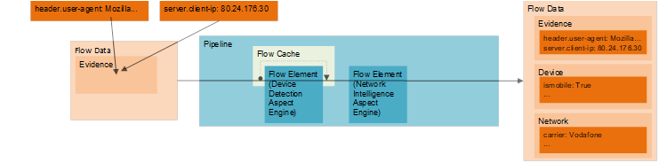

# Introduction

This folder structure contains a language agnostic specification for the 51Degrees v4 Pipeline API. 
We aim to avoid specific details of classes, interfaces, methods or the like. The focus is on the behaviour rather than the method by which that behaviour is achieved. This allows implementers to choose an architectural approach that is most appropriate for the target language.

# Structure

This specification is broken down into separate markdown files in multiple directories.
If you're not sure where to start, read through the primer sections below before exploring further.

# Terminology

-   Evidence – Data that a web application receives as part of a web request.
-   Aspect – An Aspect refers to a discrete item of interest within the end-to-end context of a web request. E.g. The hardware device used to make the request or the mobile network that the device is currently using.
-   Flow Data – user facing data object containing both the evidence, and the Aspect properties based on the evidence.
-   Flow Element – A black box that accepts Flow Data and performs some operation. It will usually populate the Flow Data with Aspect property values but may also/only update evidence or other values.
-   Pipeline – A collection of Flow Elements to enable the user to do all the processing they require on Flow Data with a single call.
-   Dictionary – A key-value store. Also commonly called a map or hashmap in different languages.

More details of these terms can be found in the [conceptual overview](conceptual-overview.md).

# Example Usage

A Pipeline is a means of managing Flow Elements (for example, a Device Detection Aspect Engine). Any number of Flow Elements can be added to a Pipeline and can be run in sequence or parallel depending on the configuration.

As shown in the diagram below, a user adds evidence to a Flow Data’s evidence collection, passes the Flow Data through a Pipeline, and can then access values of the Flow Data Aspects which have been populated by the Flow Elements within the Pipeline.



In this depiction there are two Flow Elements in the Pipeline which populate the “Device” and “Network” Aspects of the Flow Data. It should also be noted that the Device Detection Aspect Engine has an extra cache layer. This caches the “Device” Aspect based on what it deems to be relevant evidence, and is an optional performance optimization for a Flow Element.

The method of obtaining evidence to add to a Flow Data is left up to the user (although this will be handled automatically if using a Web application integration). Once the evidence has been obtained by the user, it can be added to the Flow Data’s evidence using either the dictionary/map interface, or the various helper methods for common pieces of evidence.

In pseudo-code, a basic example would go as follows:

```
pipeline = PipelineBuilder
    .AddFlowElement(deviceDetection)
    .Build()
devicedata = pipeline
    .CreateFlowData()
    .SetUserAgent(userAgent)
    .Process()
    .GetFromElement(deviceDetection)
isMobile = devicedata.IsMobile
```

More examples can be found in [use-cases](use-cases.md).