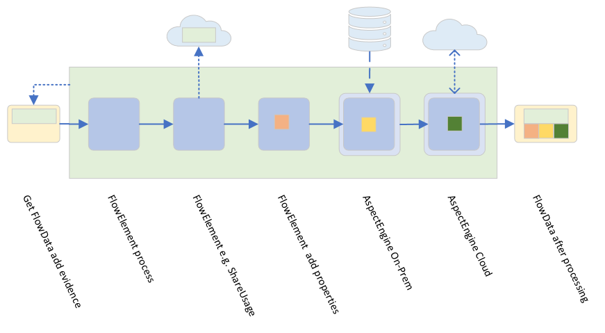

# Introduction

This folder structure contains a language agnostic specification for the 51Degrees
v4 Pipeline API.
We aim to avoid specific details of classes, interfaces, methods or the like. The
focus is on the behavior rather than the method by which that behavior is achieved.
This allows implementers to choose an architectural approach that is most appropriate
for the target language.

# Structure

This specification is broken down into separate markdown files in multiple directories.

| Directory | Description |
|---|---|
| features | Descriptions of Pipeline API features |
| advanced-features | Descriptions of Pipeline API features that are not implemented in all languages and/or do not have strong enough justifications for the complexity they add |
| Pipeline-elements | Specifications for **Flow Elements** that are needed to provide core functionality  |

If you're not sure where to start, read through the primer section below before
exploring further.

# Description

51Degrees `Pipeline` provides a framework within which input data is transformed
and enriched to create output data to be consumed by some application.

Note that more concrete details on the terms defined here can be found in the
[conceptual overview](conceptual-overview.md).

## Flow

Processing is performed by a sequence of steps which consume the
output of earlier steps and produce output of their own. The sequence of
steps is called *flow*: the steps are called `Flow Elements` and the data
transferred between them is called `Flow Data`.

Flow is unidirectional and does not provide for branching and looping. Parallel
operation of steps or a sequence of steps is possible.

Flow Elements consume `Evidence` and may produce `Element Data`. This consists
of name-value pairs of Property values which are accessible by Property name.
There `Element Data` instances are then stored in the Flow Data. Hence, Flow
Elements may also consume `Element Data` generated earlier in the flow.
Flow Elements "advertise" the Evidence that they consume, the Properties that
they produce, a key for accessing those Properties from the Flow Data and various
information about the data types within which those Properties are found.

## Flow Data Lifecycle

Creation of Flow Data is carried out by an application requesting an instance
from a Pipeline. With a number of important exceptions, the creating
application must destroy the Flow Data once it has completed its processing.

The application carries out the initial population of Evidence
and then requests that the Pipeline `process` it - i.e. present the Flow Data
to the various Flow Elements that comprise it, in sequence. Processing is
synchronous by default and the application may consume Properties produced
during processing once it is complete. A Flow Data may only be processed
once and belongs to exactly one Pipeline.

Flow Data may also be used to report errors that occur during processing.

## Engine

An `Engine` is a specialization of a Flow Element, which builds on the basic
functionality provided by Flow Element to provide higher level functions
in a consistent way.

An `Aspect Engine` concerns itself with processing Evidence to populate
Properties related to some *Aspect* related to the received Evidence. For example,
*Device Detection* concerns itself with determining the Aspects of *hardware*,
*browser* and *operating system* determined by analysis of Evidence received
in an HTTP request, such as HTTP Headers and Cookies.

Engines are classed as `Cloud` Engines, which carry out their processing
by delegation to a remote server, and `On-Premise` Engines, which typically
carry out processing by reference to one or more data files, stored locally.
Facilities are available for update and installation of such data files.

Where both Cloud and On-Premise variants of an Engine are available, they should
arrange that the Properties and values produced are compatible with each other
so that the Engines may be substituted in the Pipeline without alteration to
the consuming application.

Engines may be configured with caches and offer the ability to carry out lazy
evaluation of Property values. Engine instances may be shared between Pipelines.

