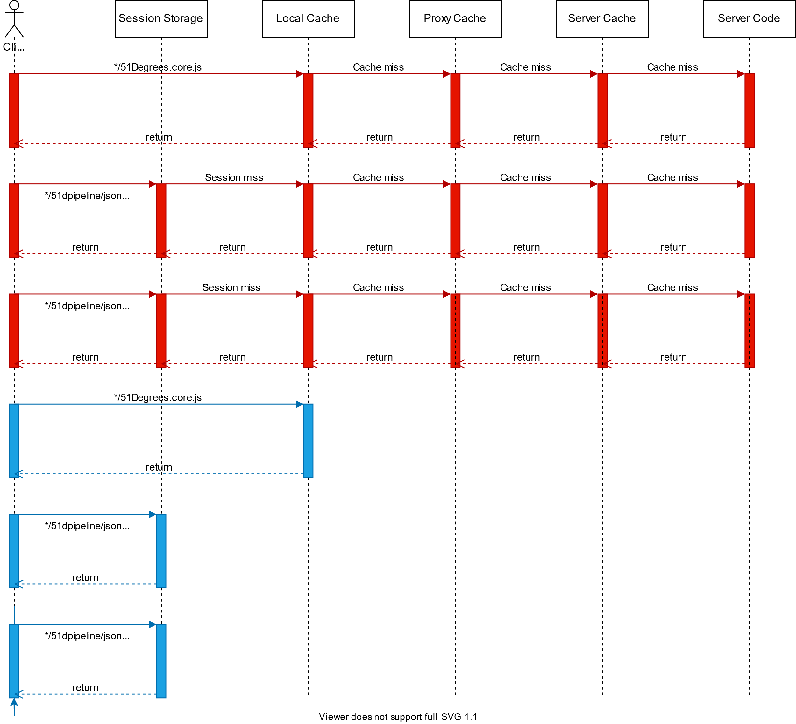

# Web integration

The web integration feature is intended to simplify usage of the Pipeline API
in websites/applications that are built using a particular web framework.

The exact details will vary significantly based on the web framework that
is being used. The capabilities and common usage of the target web framework
will need to be fully understood so that the integration is in keeping with that
ecosystem, rather than simply repeating what worked for some other
language/framework.

Some common tasks that the web integration performs are:

- Creation of Pipeline on start-up.
- Manage Flow Data lifecycle
  - Create Flow Data when an HTTP request comes in
  - Populate Evidence values and call 'Process'
  - Make the processed Flow Data easily accessible to other parts of the
    application so the results can be used.
  - Handle [resource cleanup](resource-cleanup.md) once request handling is
    completed.
- Handling requests for [client-side](#client-side-features) functionality.
- Set HTTP response headers to request additional information if needed.

## Pipeline configuration

The web integration makes use of several Flow Elements in order to support
[client-side](#client-side-features) functionality.

Where the web integration is responsible for creation of the Pipeline, it
will also need to ensure that these additional Flow Elements are present.

- The [Sequence Element](../pipeline-elements/sequence-element.md) MUST be
  present. If not, it MUST be added as the first element in the Pipeline.
- The [JSON Builder Element](../pipeline-elements/json-builder.md) MUST be
  present. If not, it MUST be added as the penultimate element.
  (Immediately before the JavaScript Builder Element).
- The [JavaScript Builder Element](../pipeline-elements/javascript-builder.md)
  MUST be present. If not, it MUST be added after all other elements.

Another Flow Element is needed to allow the web integration to automatically
set HTTP response headers.

- The [Set Headers Element](../pipeline-elements/set-headers-element.md) MUST
  be present. If not, it MUST be added after all other elements.

For all of these elements, there MUST be configuration options to allow
users to prevent them being added if they wish to do so.

## Populating Evidence

The web integration SHOULD automatically populate [Evidence](evidence.md) from
the web request.

It MAY use the Pipeline's [accepted Evidence](advertize-accepted-evidence.md)
feature to determine if individual values need to be added to Evidence or not.

An alternative approach would be to wrap the web request structure itself as
Evidence, and hence defer processing until the Evidence is actually used.

In any case, the list below illustrates the type of data that can be used
and the Evidence names they would be associated with.

- All HTTP headers. (Except cookies header) Key is `header.[header name]`
- All cookies. Key is `cookie.[cookie name]`
- All query string parameters. Key is `query.[parameter name]`
- All form parameters from POST requests. Key is `query.[parameter name]`
- Where there is an HTTP session object, data stored in the session. Key is `session.[value name]`
- Public client IP. Key is `server.client-ip`
- Request protocol. Can come from the request itself or headers such as
  `X-Origin-Proto` or `X-Forwarded-Proto`. Key is `header.protocol`

## Setting response headers

The [Set Headers Element](../pipeline-elements/set-headers-element.md) will
produce an output that describes which response headers need to be set to which
values.

However, it has no access to the web request itself. Consequently, the web
integration logic will need to take this output and actually set the necessary
response headers.

Where the relevant headers are already set to some value, append the new
value, rather than replacing the existing value.

## Client-side features

There are two major client-side features that the web integration provides:

1. Enable the execution of JavaScript snippets which can be used to gather
   additional Evidence. Handle passing this data back to the Pipeline for
   processing.
2. Allow the user to access results of Pipeline processing in client side
   code.

### Access to results

Generally, this is achieved by adding a specific JavaScript include to the HTML
page. The web integration intercepts the request to this URL and serves a
JavaScript object that can be used to access the results from processing.

### JavaScript snippets

Elements can return Properties with a type of
[Javascript](properties.md#the-javascript-type). For these Properties,
the Property value contains JavaScript code that is intended to be
executed on the client device.

As these JavaScript Property values are part of the result set, they will
already be accessible in client-side code through the JavaScript include that
is discussed in the section above.

Therefore, in order to meet this requirement, the JavaScript include will need to:

1. Identify these JavaScript Property values
2. Execute the snippets
3. Call back to the server, including the results from the execution of the
   snippets
4. Use the result from the callback to update the result data set
5. Repeat if there are any JavaScript Property values in the new result set.
   (only repeat up to a configurable limit in order to avoid infinite loops)

### Flow Elements

These features are implemented using the web integration logic itself, along
with several Flow Elements:

- [Sequence Element](../pipeline-elements/sequence-element.md) - Used to
  prevent the infinite loops described in the section above.
- [JSON Builder Element](../pipeline-elements/json-builder.md) - Converts the
  Property values in the current Flow Data into a JSON data object.
- [JavaScript Builder Element](../pipeline-elements/javascript-builder.md) -
  Takes the output from JSON Builder Element and packages it within a JavaScript
  template.

### Intercepted Urls

In order for this to work, the web integration needs to intercept requests
to two urls. These SHOULD be configurable, but the default values are:

- `/51Degrees.core.js` - Serves the JavaScript produced by JavaScript Builder Element.
- `/51dpipeline/json` - Serves the JSON produced by JSON Builder Element.

#### Client-side caching

Where possible, we want to prevent the client from evaluating JavaScript or
making requests unnecessarily. To achieve this, the web integration will
need to include logic to set HTTP cache control headers when responding to
requests to these intercepted endpoints.

##### Storing results of POST requests

Requests to the JSON endpoint will be POST requests, as opposed to the GET
requests made to the JavaScript endpoint.

This is a problem because most browsers do not consider POST requests to be
cache-able and will not respect cache headers.

The reference implementations work around this by using the session storage
API. See the
[JavaScript Builder Element](../pipeline-elements/javascript-builder.md#session-storage-caching)
for more details.

##### Caching example

Below is a request/response diagram showing what we want to happen when an
initial request is made (in red) and the user then moves to another page on
the same site (in blue).
See the descriptions below for a detailed walkthrough of what is happening
on each line.

###### Line 1: first request to JavaScript endpoint

A client connecting to a web server that uses a Pipeline API with web
integration will typically be directed to download a script such as
51Degrees.core.js. The local cache will not have this as it is the first
request. Proxy and server caches will never cache this resource, so will also be
cache misses. The web integration code will intercept the request on the server
and serve the JavaScript that is produced by the JavaScript Builder Element in the
Pipeline.

The JavaScript in the response will then run on the client. If any JavaScript
Properties are present, they will be executed. Any new pieces of Evidence
produced because of processing these JavaScript Properties will be added to the
parameters list. A request will then be sent to the callback URL.

###### Line 2: first request to JSON endpoint

As this is the first request, there is nothing in the session storage.
Proxy and server caches will never cache this resource. On the server, the
request to the JSON endpoint will again be intercepted and handled. This time,
by responding with the output from the JSON Builder Element.

The JavaScript code running on the client will update its JSON data with the one
from the response. In addition, the payload will be stored in session storage
using the Session ID as the key, the JavaScript Properties that ran will be
flagged in session storage also and the sequence number sent in the callback
request body will be incremented.

If the JSON payload still contains JavaScript Properties, the process repeats.

###### Line 3: second request to JSON endpoint (different parameters to 1st request)

This time, the sequence number in the request body will be 2 and new Evidence
will have been provided. The session storage will be invalid as the parameters have
changed. The request to the callback URL is made with the new Evidence and any
existing Evidence to get an updated JSON payload. The JavaScript will again
update its internal JSON data with the one from the response and store it in
session storage along with all the JavaScript Properties that have been run.

###### Line 4: skipping second request to JavaScript endpoint

We now assume that the user moves to another page on the same website. This page
also includes the directive to download 51Degrees.core.js. This time, the local
cache can serve the same JavaScript response that it used previously.

###### Line 5 + 6: skipping third and fourth requests to JSON endpoint

The script will be the original version that was obtained from the JavaScript
endpoint previously. As such, it will go through the same process of checking
session storage for existing results and executing JavaScript Properties.

First, the session storage is checked to see if the JavaScript Properties to be
run have been run already. If this is the case then the session storage is
checked to see if it contains a JSON payload using the cached Session ID as the
key. If the payload is found, then this is loaded into the JavaScript’s internal
JSON data and no requests to the callback URL need to be made.

This will then repeat as before for any JavaScript Properties in the new payload.

##### Cache header detail

The HTTP response headers that MUST be set for the JSON and JavaScript endpoints
are:

| **Header**     | **Values**                                                                          | **Purpose**                                                                                             |
|----------------|-------------------------------------------------------------------------------------|---------------------------------------------------------------------------------------------------------|
| Cache-Control  | max-age=1800 private                                                                | Cache item lifetime is 30 minutes. Only local client caches can cache this content.                  |
| Vary           | all headers in Pipeline Evidence key filter (e.g. User-Agent)                       | Let the cache know that if one of these headers changes, the cached content will need to be re-fetched. |
| ETag           | Calculated hash of ALL the Evidence values in Evidence filter key for this Pipeline | Assists caches in re-validating expired content                                                         |
| Content-Type   | application/x-javascript or application/JSON                                        | Indicate the type of content being returned                                                             |
| Content-Length | Content length in bytes                                                             | Indicate the expected length of the content                                                             |

In order to validate the ETag, the JSON and JavaScript endpoints will need to check for
an 'If-None-Match' header in the request. This will be sent when a cached item’s
lifetime has expired and the cache needs to check if what it holds is still
valid.

If the value in the 'If-None-Match' header matches the calculated ETag value for
the current request, then the content in the cache is still valid and the
endpoint can just return a 304 status code. (Not modified)

This process could lead to responses that are not strictly
correct if the JavaScript snippet is getting data values that might change over time.
For example, if we're using JavaScript to get location and the user has moved then
session storage will still contain the previous location lookup response.
In practice this seems unlikely to cause any real issues, as long as the cache
max-age is not too long. Max-age SHOULD be configurable to allow this to be addressed
if it is found to be an issue for a particular client.
